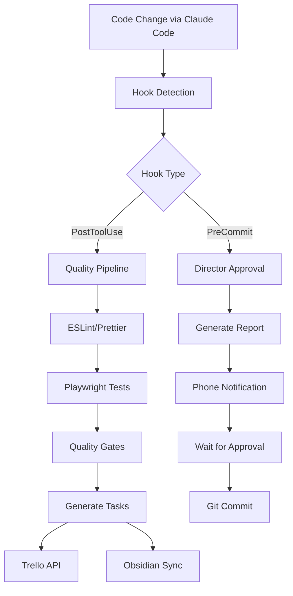

# 🤖 Claude Code Automation System Guide

> **Complete development automation for solo developers**  
> Automated testing, documentation, todo management, and quality gates

## 📋 Table of Contents

1. [🎯 Overview](#-overview)
2. [⚡ Quick Start](#-quick-start)
3. [🏗️ Architecture](#️-architecture)
4. [⚙️ Configuration Reference](#️-configuration-reference)
5. [🔧 Core Components](#-core-components)
6. [📝 Workflow Examples](#-workflow-examples)
7. [📚 API Reference](#-api-reference)
8. [🧪 Testing Integration](#-testing-integration)
9. [🚨 Troubleshooting](#-troubleshooting)
10. [🔮 Advanced Features](#-advanced-features)

---

## 🎯 Overview

### What This System Provides

This automation system transforms your solo development workflow by providing:

- **🔄 Automatic Documentation** - Real-time updates to Obsidian vault
- **✅ Quality Gates** - Automated testing and code quality checks
- **📋 Smart Task Management** - Dual Trello/Obsidian todo systems
- **📱 Director Notifications** - Phone alerts for commit readiness
- **📊 Performance Monitoring** - Bundle size, complexity tracking
- **🎯 Context-Aware Automation** - Project-specific workflows

### Benefits for Solo Developers

| Feature           | Manual Process  | Automated Process | Time Saved |
| ----------------- | --------------- | ----------------- | ---------- |
| Documentation     | 30+ min/feature | Automatic         | 100%       |
| Testing           | 15+ min/change  | Automatic         | 95%        |
| Todo Creation     | 5+ min/task     | Instant           | 90%        |
| Quality Checks    | 20+ min/session | Automatic         | 100%       |
| Progress Tracking | 10+ min/day     | Automatic         | 100%       |

### Prerequisites

#### Required Software

- **Claude Code** (latest version)
- **PowerShell** 5.1+ (Windows) or PowerShell Core 7+
- **Node.js** 18+ and npm
- **Git** for version control

#### Optional Integrations

- **Obsidian** for documentation
- **Trello** for project management
- **Playwright** for UI testing
- **WhatsApp/Telegram** for notifications

#### Accounts & API Keys

- **Trello API** key and token (optional)
- **Notification service** credentials (optional)

---

## ⚡ Quick Start

### 1. Initial Setup (5 minutes)

```powershell
# Navigate to your project
cd /path/to/your/project

# Run setup script
.\.claude\scripts\setup-integration.ps1
```

### 2. Configure Your Paths

Edit `.claude/settings.json`:

```json
{
  "project": {
    "name": "YourProject",
    "description": "Your project description"
  },
  "obsidian": {
    "vault_path": "C:/Users/YourUsername/Documents/Notes 2025/",
    "project_folder": "CodeStation"
  }
}
```

### 3. Test the System

```bash
# Make any code change via Claude Code
# Watch for automatic updates in your Obsidian vault
```

### 4. Verify Integration

Check these locations:

- **Obsidian**: `Notes 2025/CodeStation/Development Progress.md`
- **Console**: PowerShell output for successful sync
- **Files**: `.claude/` directory structure

---

## 🏗️ Architecture

### System Flow Diagram



### Component Relationships

| Component              | Depends On         | Triggers     | Output                |
| ---------------------- | ------------------ | ------------ | --------------------- |
| **Hook System**        | Claude Code        | Code changes | Script execution      |
| **Quality Pipeline**   | ESLint, Playwright | PostToolUse  | Pass/Fail status      |
| **Task Generator**     | Project detection  | Quality pass | Trello/Obsidian tasks |
| **Director System**    | Quality pipeline   | PreCommit    | Approval workflow     |
| **Documentation Sync** | Obsidian vault     | All hooks    | Real-time updates     |

---

## ⚙️ Configuration Reference

### settings.json Schema

```typescript
interface SettingsConfig {
  // Hook configuration
  hooks: {
    PostToolUse: Array<{
      matcher: string; // "Write|Edit|MultiEdit"
      hooks: Array<{
        type: 'command';
        command: string; // PowerShell script path
      }>;
    }>;
  };

  // Project information
  project: {
    name: string; // Project display name
    description: string; // Project description
  };

  // Obsidian integration
  obsidian: {
    vault_path: string; // Absolute path to vault
    project_folder: string; // Folder name in vault
    progress_file?: string; // Default: "Development Progress.md"
    changelog_file?: string; // Default: "Changelog.md"
  };

  // Trello integration (optional)
  trello?: {
    api_key: string;
    token: string;
    boards: {
      [projectType: string]: string; // Board IDs
    };
  };

  // Testing configuration
  testing?: {
    framework: 'playwright' | 'jest' | 'vitest';
    coverage_threshold: number; // Default: 80
    auto_fix_lint: boolean; // Default: true
  };

  // Notification settings
  notifications?: {
    enabled: boolean;
    service: 'whatsapp' | 'telegram' | 'sms';
    phone_number?: string;
    webhook_url?: string;
  };
}
```

### Hook Event Parameters

```typescript
interface HookContext {
  // Environment variables available in scripts
  CLAUDE_TOOL_NAME: string; // "Write", "Edit", "MultiEdit"
  CLAUDE_FILE_PATH: string; // Absolute path to changed file
  CLAUDE_PROJECT_DIR: string; // Project root directory
  CLAUDE_TIMESTAMP: string; // ISO timestamp
  CLAUDE_USER: string; // Current user
}
```

### PowerShell Script Parameters

```powershell
# Standard parameters for all scripts
param(
    [string]$Action = $env:CLAUDE_TOOL_NAME,
    [string]$FilePath = $env:CLAUDE_FILE_PATH,
    [string]$Timestamp = (Get-Date -Format "yyyy-MM-dd HH:mm:ss")
)
```

---

## 🔧 Core Components

### 1. Hook System

#### Available Hook Types

| Hook Type     | Trigger             | Use Case       | Example               |
| ------------- | ------------------- | -------------- | --------------------- |
| `PostToolUse` | After Write/Edit    | Quality checks | Linting, testing      |
| `PreCommit`   | Before git commit   | Approval flow  | Director notification |
| `PostCommit`  | After commit        | Documentation  | Update changelogs     |
| `PostBuild`   | After build success | Metrics        | Bundle analysis       |

#### Hook Configuration

```json
{
  "hooks": {
    "PostToolUse": [
      {
        "matcher": "Write|Edit",
        "hooks": [
          {
            "type": "command",
            "command": "npm run lint --fix"
          },
          {
            "type": "command",
            "command": "npx playwright test"
          },
          {
            "type": "command",
            "command": "powershell .claude/scripts/sync-to-obsidian-fixed.ps1"
          }
        ]
      }
    ]
  }
}
```

### 2. Obsidian Integration

#### Vault Structure

```
Notes 2025/
└── CodeStation/
    ├── Development Progress.md    # Real-time progress tracking
    ├── Changelog.md              # Automated change logs
    ├── Feature Implementation.md  # Component development status
    ├── Code Metrics.md           # Performance analytics
    ├── Daily Todos.md            # Auto-generated tasks
    └── Weekly Reviews.md         # Automated summaries
```

#### Template System

**Progress Entry Template:**

```markdown
## {{TIMESTAMP}} - Claude Code Auto-Update

- **Action**: {{ACTION}}
- **File**: {{FILE_PATH}}
- **Status**: ✅ Completed
- **Source**: Claude Code Automation
- **Project**: {{PROJECT_NAME}}
```

**Task Template:**

```markdown
- [ ] **{{TASK_TITLE}}**
  - 📁 Project: {{PROJECT_NAME}}
  - 📄 File: {{FILE_PATH}}
  - 🏷️ Type: {{TASK_TYPE}}
  - ⏰ Created: {{TIMESTAMP}}
  - 🔗 Trello: {{TRELLO_LINK}}
  - 📝 Notes: {{AUTO_DESCRIPTION}}
```

### 3. Trello Integration

#### Board Detection Logic

```powershell
$projectMappings = @{
    "components/templates" = "Prompt Website Board"
    "components/workflows" = "CodeStation Board"
    "src/components"      = "UI Components Board"
    "src/pages"          = "Pages Board"
    "tests/"             = "Testing Board"
}
```

#### Task Generation Rules

| File Pattern       | Task Type     | Priority | Due Date |
| ------------------ | ------------- | -------- | -------- |
| `*.test.js`        | Testing       | High     | +1 day   |
| `components/*.jsx` | Component     | Medium   | +3 days  |
| `pages/*.jsx`      | Feature       | High     | +2 days  |
| `utils/*.js`       | Utility       | Low      | +5 days  |
| `*.md`             | Documentation | Low      | +7 days  |

#### API Integration

```javascript
// Trello API wrapper
class TrelloIntegration {
  constructor(apiKey, token) {
    this.apiKey = apiKey;
    this.token = token;
  }

  async createCard(boardId, listId, cardData) {
    // Implementation
  }

  async updateCard(cardId, updates) {
    // Implementation
  }
}
```

### 4. Quality Pipeline

#### Automated Checks

```powershell
# Quality gate sequence
1. ESLint --fix                 # Auto-fix linting issues
2. Prettier --write             # Format code
3. TypeScript check             # Type validation
4. Playwright test              # UI/Integration tests
5. Bundle analysis              # Size/performance check
6. Security audit               # Dependency vulnerabilities
```

#### Quality Gate Logic

```typescript
interface QualityResult {
  passed: boolean;
  checks: {
    lint: { passed: boolean; errors: number; warnings: number };
    format: { passed: boolean; filesChanged: number };
    types: { passed: boolean; errors: number };
    tests: { passed: boolean; testsRun: number; failures: number };
    bundle: { passed: boolean; size: number; threshold: number };
    security: { passed: boolean; vulnerabilities: number };
  };
  overall: 'pass' | 'fail' | 'warning';
}
```

---

## 📝 Workflow Examples

### Solo Developer Daily Workflow

#### Morning Startup

```bash
# 1. Open project in Claude Code
cd /your-project

# 2. Check overnight automation results
cat .claude/logs/overnight-summary.md

# 3. Review Obsidian daily focus
# Opens: Notes 2025/CodeStation/Daily Todos.md
```

#### Development Session

```typescript
// 1. Start coding session
// 2. Make changes via Claude Code
// 3. Automatic triggers:
//    - PostToolUse hook runs
//    - Quality checks execute
//    - Tasks generated in Trello/Obsidian
//    - Progress tracked

// 4. Director notification sent when ready
// 5. Review and approve commit
// 6. Automated deployment (if configured)
```

#### End of Day Review

```powershell
# Generate daily summary
.\.claude\scripts\generate-daily-summary.ps1

# Output: Obsidian daily review with:
# - Tasks completed
# - Quality metrics
# - Time spent per project
# - Productivity insights
```

### Dual Todo System Comparison

#### Week 1-2: Parallel Usage

**Obsidian Todos (Speed-focused):**

```markdown
# Today's Quick Tasks

- [ ] Fix template validation (15min)
- [ ] Update component props (30min)
- [ ] Review PR feedback (45min)

# This Week

- [ ] Refactor workflow editor
- [ ] Add Playwright tests
- [ ] Performance optimization
```

**Trello Cards (Visual-focused):**

```
📋 To Do
├── 🐛 Fix template validation
├── 🔧 Update component props
├── 👀 Review PR feedback

📋 Doing (WIP Limit: 3)
├── 🚀 Refactor workflow editor

📋 Done
├── ✅ Setup automation hooks
├── ✅ Configure Obsidian sync
```

#### Usage Analytics

```typescript
interface TodoUsageMetrics {
  obsidian: {
    tasksCompleted: number;
    averageResponseTime: number; // minutes
    preferredFor: string[]; // ["quick-tasks", "notes"]
  };
  trello: {
    tasksCompleted: number;
    averageResponseTime: number;
    preferredFor: string[]; // ["visual-planning", "progress"]
  };
  recommendation: 'obsidian' | 'trello' | 'hybrid';
}
```

### Project Context Detection

#### Multi-Project Setup

```powershell
# Project detection logic
function Get-ProjectContext {
    param([string]$FilePath)

    $contexts = @{
        "prompt-website"  = @("src/components/templates", "src/pages/templates")
        "game-dev"       = @("src/game", "assets/", "scenes/")
        "ai-story"       = @("story/", "characters/", "plots/")
        "codestation"    = @("src/workflows", "src/automation")
    }

    foreach ($project in $contexts.Keys) {
        foreach ($pattern in $contexts[$project]) {
            if ($FilePath -like "*$pattern*") {
                return $project
            }
        }
    }

    return "general"
}
```

---

## 📚 API Reference

### Hook Script Interface

#### Input Parameters

```typescript
interface ScriptInput {
  Action: 'Write' | 'Edit' | 'MultiEdit' | 'Delete';
  FilePath: string; // Absolute path to changed file
  Timestamp: string; // ISO 8601 format
  ProjectRoot: string; // Project directory
  User: string; // Current user
}
```

#### Expected Output

```typescript
interface ScriptOutput {
  success: boolean;
  message: string;
  data?: {
    tasksCreated?: number;
    filesUpdated?: string[];
    metrics?: Record<string, any>;
  };
  errors?: string[];
}
```

#### Error Handling

```powershell
# Standard error handling pattern
try {
    # Script logic here
    Write-Host "✅ Operation completed successfully"
    exit 0
} catch {
    Write-Host "❌ Error: $($_.Exception.Message)" -ForegroundColor Red
    exit 1
}
```

### Obsidian Sync API

#### Vault Operations

```typescript
interface VaultOperations {
  createFile(path: string, content: string): Promise<void>;
  appendToFile(path: string, content: string): Promise<void>;
  updateFile(path: string, content: string): Promise<void>;
  createFolder(path: string): Promise<void>;
  linkFiles(source: string, target: string): Promise<void>;
}
```

#### Template Variables

```typescript
interface TemplateVariables {
  // Time-based
  DATE: string; // YYYY-MM-DD
  TIME: string; // HH:MM:SS
  TIMESTAMP: string; // Full ISO timestamp

  // Project context
  PROJECT_NAME: string;
  FILE_PATH: string;
  FILE_NAME: string;
  DIRECTORY: string;

  // Action context
  ACTION: string;
  USER: string;
  CHANGE_TYPE: string;

  // Metrics
  LINES_CHANGED: number;
  COMPLEXITY_SCORE: number;
  FILE_SIZE: number;
}
```

### Trello API Integration

#### Card Creation

```typescript
interface TrelloCard {
  name: string;
  desc: string;
  pos: 'top' | 'bottom' | number;
  due?: string; // ISO date
  idLabels?: string[]; // Label IDs
  idMembers?: string[]; // Member IDs
  idChecklists?: string[]; // Checklist IDs
}

interface TrelloAPIResponse {
  id: string;
  url: string;
  shortUrl: string;
  name: string;
  desc: string;
}
```

#### Error Responses

```typescript
interface TrelloError {
  error: string;
  message: string;
  statusCode: number;
}
```

---

## 🧪 Testing Integration

### Playwright Configuration

#### Test Generation Logic

```typescript
// Auto-generate tests based on component changes
interface TestGeneration {
  triggers: {
    'src/components/*.jsx': 'component-test';
    'src/pages/*.jsx': 'page-test';
    'src/utils/*.js': 'unit-test';
  };

  templates: {
    'component-test': 'tests/templates/component.spec.js';
    'page-test': 'tests/templates/page.spec.js';
    'unit-test': 'tests/templates/unit.spec.js';
  };
}
```

#### Test Execution Pipeline

```powershell
# Automated test sequence
function Invoke-TestPipeline {
    param([string]$FilePath, [string]$ChangeType)

    # 1. Determine test scope
    $testScope = Get-TestScope -FilePath $FilePath

    # 2. Run appropriate tests
    switch ($testScope) {
        "component" {
            npx playwright test --grep="component"
        }
        "integration" {
            npx playwright test --grep="integration"
        }
        "e2e" {
            npx playwright test
        }
    }

    # 3. Generate test report
    $report = ConvertFrom-Json (Get-Content "test-results.json")

    # 4. Update quality gate status
    Update-QualityGate -TestResults $report
}
```

#### Test Report Structure

```typescript
interface TestReport {
  summary: {
    total: number;
    passed: number;
    failed: number;
    skipped: number;
    duration: number; // milliseconds
  };

  failures: Array<{
    test: string;
    error: string;
    screenshot?: string;
    trace?: string;
  }>;

  coverage: {
    statements: number; // percentage
    branches: number;
    functions: number;
    lines: number;
  };

  performance: {
    slowestTests: Array<{
      name: string;
      duration: number;
    }>;
    memoryUsage: number;
  };
}
```

### Quality Gates

#### Gate Configuration

```yaml
quality_gates:
  lint:
    enabled: true
    max_errors: 0
    max_warnings: 5
    auto_fix: true

  tests:
    enabled: true
    min_coverage: 80 # percentage
    max_failures: 0
    timeout: 300000 # 5 minutes

  performance:
    enabled: true
    max_bundle_size: 500 # KB
    max_load_time: 3000 # milliseconds

  security:
    enabled: true
    max_vulnerabilities: 0
    audit_level: 'moderate'
```

#### Gate Execution

```powershell
function Test-QualityGates {
    param([string]$FilePath)

    $results = @{
        lint = Test-LintGate
        tests = Test-TestGate
        performance = Test-PerformanceGate
        security = Test-SecurityGate
    }

    $overallPassed = $results.Values | ForEach-Object { $_.passed } |
                     Measure-Object -Sum | Select-Object -ExpandProperty Sum

    return @{
        passed = ($overallPassed -eq $results.Count)
        details = $results
        timestamp = Get-Date -Format "yyyy-MM-ddTHH:mm:ss.fffZ"
    }
}
```

---

## 🚨 Troubleshooting

### Common Issues

#### 1. PowerShell Execution Policy

**Problem:** Scripts fail with execution policy error

**Solution:**

```powershell
# Check current policy
Get-ExecutionPolicy -Scope CurrentUser

# Set to allow script execution
Set-ExecutionPolicy -ExecutionPolicy RemoteSigned -Scope CurrentUser

# Verify change
Get-ExecutionPolicy -Scope CurrentUser
```

#### 2. Obsidian Vault Path Issues

**Problem:** Cannot find or access Obsidian vault

**Symptoms:**

- Directory creation errors
- File write permissions denied
- Path not found errors

**Solutions:**

```powershell
# Test vault accessibility
Test-Path "C:/Users/Username/Documents/Notes 2025/"

# Create directory if missing
New-Item -ItemType Directory -Path "C:/Users/Username/Documents/Notes 2025/CodeStation" -Force

# Check permissions
Get-Acl "C:/Users/Username/Documents/Notes 2025/"
```

#### 3. Hook Not Triggering

**Problem:** Code changes don't trigger automation

**Debug Steps:**

```powershell
# 1. Verify hook configuration
Get-Content .claude/settings.json | ConvertFrom-Json | Select-Object -ExpandProperty hooks

# 2. Test script manually
.\.claude\scripts\sync-to-obsidian-fixed.ps1 -Action "Test" -FilePath "test.js"

# 3. Check Claude Code logs
Get-Content $env:APPDATA\.claude\logs\*.log | Select-String -Pattern "hook"
```

#### 4. Trello API Issues

**Problem:** Cannot create cards or access boards

**Common Causes:**

- Invalid API key or token
- Insufficient permissions
- Rate limiting
- Network connectivity

**Solutions:**

```powershell
# Test API connectivity
$response = Invoke-RestMethod -Uri "https://api.trello.com/1/members/me" -Method GET -Body @{
    key = "YOUR_API_KEY"
    token = "YOUR_TOKEN"
}

# Verify board access
$boards = Invoke-RestMethod -Uri "https://api.trello.com/1/members/me/boards" -Method GET -Body @{
    key = "YOUR_API_KEY"
    token = "YOUR_TOKEN"
}
```

### Performance Issues

#### 1. Slow Hook Execution

**Symptoms:**

- Long delays after code changes
- Timeout errors
- High CPU usage

**Optimization:**

```powershell
# Profile script execution
Measure-Command { .\.claude\scripts\sync-to-obsidian-fixed.ps1 }

# Optimize by:
# - Reducing file I/O operations
# - Caching API responses
# - Running hooks in parallel
# - Implementing smart throttling
```

#### 2. Large File Handling

**Problem:** Scripts slow or fail with large files

**Solutions:**

```powershell
# File size check
$fileSize = (Get-Item $FilePath).Length
if ($fileSize -gt 1MB) {
    Write-Warning "Large file detected, using optimized processing"
    # Use streaming or chunked processing
}
```

### Error Recovery

#### Automatic Recovery

```powershell
function Invoke-WithRetry {
    param(
        [ScriptBlock]$ScriptBlock,
        [int]$MaxRetries = 3,
        [int]$DelaySeconds = 1
    )

    for ($i = 1; $i -le $MaxRetries; $i++) {
        try {
            return & $ScriptBlock
        } catch {
            if ($i -eq $MaxRetries) {
                throw
            }
            Write-Warning "Attempt $i failed, retrying in $DelaySeconds seconds..."
            Start-Sleep -Seconds $DelaySeconds
        }
    }
}
```

#### Rollback Procedures

```powershell
# Backup before operations
function Backup-SystemState {
    $backupPath = ".claude/backups/$(Get-Date -Format 'yyyy-MM-dd-HH-mm-ss')"
    New-Item -ItemType Directory -Path $backupPath -Force

    # Backup configurations
    Copy-Item ".claude/settings.json" "$backupPath/settings.json"

    # Backup Obsidian state
    $obsidianState = @{
        vault_path = $settings.obsidian.vault_path
        last_sync = Get-Date
        file_count = (Get-ChildItem $settings.obsidian.vault_path -Recurse).Count
    }
    $obsidianState | ConvertTo-Json | Set-Content "$backupPath/obsidian-state.json"
}
```

### Debugging Tools

#### Log Analysis

```powershell
# Enable detailed logging
$env:CLAUDE_DEBUG = "1"
$env:CLAUDE_LOG_LEVEL = "verbose"

# View logs in real-time
Get-Content .claude/logs/automation.log -Wait -Tail 10
```

#### Health Check Script

```powershell
# .claude/scripts/health-check.ps1
function Test-SystemHealth {
    $results = @{}

    # Test PowerShell version
    $results.PowerShell = $PSVersionTable.PSVersion.ToString()

    # Test file system access
    $results.FileSystem = Test-Path $settings.obsidian.vault_path

    # Test network connectivity
    $results.Network = Test-NetConnection -ComputerName "api.trello.com" -Port 443 -InformationLevel Quiet

    # Test Claude Code integration
    $results.ClaudeCode = Test-Path $env:CLAUDE_PROJECT_DIR

    return $results
}
```

---

## 🔮 Advanced Features

### Custom Hook Development

#### Creating Custom Hooks

```powershell
# Template for custom hook script
param(
    [string]$Action = $env:CLAUDE_TOOL_NAME,
    [string]$FilePath = $env:CLAUDE_FILE_PATH,
    [hashtable]$CustomParams = @{}
)

# Your custom logic here
function Invoke-CustomLogic {
    param($Action, $FilePath, $CustomParams)

    # Example: Custom Slack notification
    if ($Action -eq "Edit" -and $FilePath -like "*.jsx") {
        Send-SlackMessage -Channel "#dev" -Message "React component updated: $(Split-Path $FilePath -Leaf)"
    }
}

# Error handling
try {
    Invoke-CustomLogic -Action $Action -FilePath $FilePath -CustomParams $CustomParams
    Write-Host "✅ Custom hook executed successfully"
} catch {
    Write-Host "❌ Custom hook failed: $($_.Exception.Message)" -ForegroundColor Red
    exit 1
}
```

#### Hook Registration

```json
{
  "hooks": {
    "PostToolUse": [
      {
        "matcher": "*.jsx|*.tsx",
        "hooks": [
          {
            "type": "command",
            "command": "powershell .claude/scripts/custom-react-hook.ps1"
          }
        ]
      }
    ]
  }
}
```

### Analytics Dashboard

#### Metrics Collection

```typescript
interface DevelopmentMetrics {
  productivity: {
    linesPerDay: number;
    commitsPerDay: number;
    featuresCompleted: number;
    bugsFixed: number;
  };

  quality: {
    testCoverage: number;
    lintScore: number;
    complexityTrend: number[];
    codeSmells: number;
  };

  efficiency: {
    buildTime: number;
    testExecutionTime: number;
    deploymentFrequency: number;
    leadTime: number;
  };

  patterns: {
    mostProductiveHours: number[];
    preferredFileTypes: string[];
    averageTaskDuration: number;
    breakFrequency: number;
  };
}
```

#### Report Generation

```powershell
function New-WeeklyReport {
    $metrics = Get-DevelopmentMetrics -Days 7

    $report = @"
# 📊 Weekly Development Report
**Period:** $(Get-Date -Format 'yyyy-MM-dd') to $((Get-Date).AddDays(-7).ToString('yyyy-MM-dd'))

## 🎯 Productivity
- **Lines of Code:** $($metrics.productivity.linesPerDay * 7)
- **Commits:** $($metrics.productivity.commitsPerDay * 7)
- **Features Completed:** $($metrics.productivity.featuresCompleted)
- **Bugs Fixed:** $($metrics.productivity.bugsFixed)

## ✅ Quality Metrics
- **Test Coverage:** $($metrics.quality.testCoverage)%
- **Lint Score:** $($metrics.quality.lintScore)/100
- **Code Complexity:** $(if($metrics.quality.complexityTrend[-1] -lt $metrics.quality.complexityTrend[0]){"Improved ⬇️"}else{"Increased ⬆️"})

## ⚡ Efficiency
- **Average Build Time:** $($metrics.efficiency.buildTime)s
- **Test Execution:** $($metrics.efficiency.testExecutionTime)s
- **Deployment Frequency:** $($metrics.efficiency.deploymentFrequency) times

## 🧠 Insights
- **Most Productive Hours:** $($metrics.patterns.mostProductiveHours -join ', ')
- **Preferred Languages:** $($metrics.patterns.preferredFileTypes -join ', ')
- **Average Task Duration:** $($metrics.patterns.averageTaskDuration) minutes
"@

    $report | Set-Content "$(Get-ObsidianPath)/Weekly Report $(Get-Date -Format 'yyyy-MM-dd').md"
}
```

### Multi-Project Orchestration

#### Project Detection Engine

```powershell
function Get-ProjectConfiguration {
    param([string]$FilePath)

    $projectConfigs = @{
        "prompt-website" = @{
            trello_board = "BOARD_ID_1"
            obsidian_folder = "Prompt Website"
            test_command = "npm run test:prompt"
            deploy_command = "npm run deploy:prompt"
            quality_gates = @("lint", "test", "e2e")
        }

        "game-dev" = @{
            trello_board = "BOARD_ID_2"
            obsidian_folder = "Game Development"
            test_command = "npm run test:game"
            deploy_command = "npm run build:game"
            quality_gates = @("lint", "test", "performance")
        }
    }

    foreach ($project in $projectConfigs.Keys) {
        if (Test-ProjectMatch -FilePath $FilePath -Project $project) {
            return $projectConfigs[$project]
        }
    }

    return $projectConfigs["default"]
}
```

#### Cross-Project Dependencies

```powershell
function Update-CrossProjectDependencies {
    param([string]$ChangedProject, [string]$FilePath)

    $dependencies = @{
        "shared-components" = @("prompt-website", "game-dev")
        "utils" = @("prompt-website", "ai-story", "game-dev")
        "types" = @("prompt-website", "game-dev")
    }

    foreach ($dependency in $dependencies.Keys) {
        if ($FilePath -like "*$dependency*") {
            foreach ($affectedProject in $dependencies[$dependency]) {
                if ($affectedProject -ne $ChangedProject) {
                    New-CrossProjectTask -SourceProject $ChangedProject -TargetProject $affectedProject -ChangeType "dependency-update"
                }
            }
        }
    }
}
```

### AI-Powered Insights

#### Intelligent Task Prioritization

```powershell
function Get-IntelligentTaskPriority {
    param([string]$TaskDescription, [string]$FileType, [int]$LinesChanged)

    $weights = @{
        security = 10
        performance = 8
        user_facing = 7
        bug_fix = 9
        feature = 5
        refactor = 4
        documentation = 2
    }

    $keywords = @{
        security = @("auth", "password", "token", "security", "vulnerability")
        performance = @("slow", "optimize", "performance", "memory", "speed")
        user_facing = @("ui", "ux", "interface", "user", "frontend")
        bug_fix = @("fix", "bug", "error", "issue", "broken")
    }

    $priority = 1
    foreach ($category in $keywords.Keys) {
        foreach ($keyword in $keywords[$category]) {
            if ($TaskDescription.ToLower() -like "*$keyword*") {
                $priority = [Math]::Max($priority, $weights[$category])
            }
        }
    }

    # Adjust based on impact
    if ($LinesChanged -gt 100) { $priority += 2 }
    if ($FileType -in @(".jsx", ".tsx", ".vue")) { $priority += 1 }

    return [Math]::Min($priority, 10)
}
```

#### Predictive Analytics

```powershell
function Get-DevelopmentPredictions {
    $history = Get-DevelopmentHistory -Days 30

    $predictions = @{
        estimatedCompletionTime = Get-TaskTimeEstimate -History $history
        riskFactors = Get-RiskAssessment -History $history
        recommendedActions = Get-ActionRecommendations -History $history
        optimalWorkingHours = Get-ProductivityPatterns -History $history
    }

    return $predictions
}
```

---

## 📋 Appendix

### File Structure Reference

```
.claude/
├── settings.json                 # Main configuration
├── README.md                     # Setup instructions
├── AUTOMATION-SYSTEM-GUIDE.md    # This comprehensive guide
├── scripts/
│   ├── sync-to-obsidian-fixed.ps1      # Obsidian integration
│   ├── trello-task-creator.ps1         # Trello automation
│   ├── quality-pipeline.ps1            # Testing & quality
│   ├── director-notification.ps1       # Approval workflow
│   ├── setup-integration.ps1           # Initial setup
│   ├── health-check.ps1               # System diagnostics
│   └── generate-reports.ps1           # Analytics & reporting
├── templates/
│   ├── obsidian-progress.md           # Progress tracking template
│   ├── obsidian-changelog.md          # Changelog template
│   ├── feature-implementation.md      # Feature tracking
│   ├── trello-card.json              # Trello card template
│   └── test-case.spec.js             # Test generation template
├── logs/
│   ├── automation.log                 # General automation logs
│   ├── quality-gates.log             # Testing & quality logs
│   ├── sync-operations.log           # Obsidian/Trello sync logs
│   └── errors.log                    # Error tracking
└── backups/
    ├── 2025-07-28-15-30-00/          # Timestamped backups
    │   ├── settings.json
    │   ├── obsidian-state.json
    │   └── trello-state.json
    └── latest/                        # Latest backup link
```

### Environment Variables

```bash
# Claude Code specific
CLAUDE_TOOL_NAME=Write|Edit|MultiEdit|Delete
CLAUDE_FILE_PATH=/absolute/path/to/file
CLAUDE_PROJECT_DIR=/absolute/path/to/project
CLAUDE_TIMESTAMP=2025-07-28T15:30:00.000Z
CLAUDE_USER=username

# System configuration
CLAUDE_DEBUG=0|1                      # Enable debug mode
CLAUDE_LOG_LEVEL=info|verbose|debug   # Logging level
CLAUDE_DRY_RUN=0|1                   # Test mode (no actual changes)

# Integration settings
TRELLO_API_KEY=your_api_key
TRELLO_TOKEN=your_token
NOTIFICATION_WEBHOOK=your_webhook_url
OBSIDIAN_VAULT_PATH=/path/to/vault
```

### API Endpoints Reference

#### Trello API

- **Base URL:** `https://api.trello.com/1/`
- **Authentication:** API Key + Token
- **Rate Limits:** 100 requests per 10 seconds per token

#### Notification Services

- **WhatsApp Business API:** `https://graph.facebook.com/v17.0/`
- **Telegram Bot API:** `https://api.telegram.org/bot{token}/`
- **Slack Webhooks:** `https://hooks.slack.com/services/`

### Version History

| Version | Date       | Changes                              |
| ------- | ---------- | ------------------------------------ |
| 1.0.0   | 2025-07-28 | Initial release with core automation |
| 1.1.0   | TBD        | Enhanced testing integration         |
| 1.2.0   | TBD        | AI-powered insights                  |
| 2.0.0   | TBD        | Multi-project orchestration          |

---

_Generated by Claude Code Automation System_  
_Last updated: 2025-07-28_  
_Version: 1.0.0_
