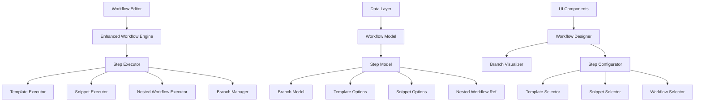

# Design Document

## Overview

De workflow branches feature transformeert het huidige lineaire workflow systeem naar een flexibel, vertakt systeem dat complexe beslissingsstructuren ondersteunt. Het design bestaat uit drie hoofdcomponenten: snippets integratie in workflow stappen, nested workflows ondersteuning, en een branching systeem dat meerdere uitvoeringspaden mogelijk maakt.

Het systeem behoudt backward compatibility met bestaande workflows terwijl het nieuwe functionaliteiten toevoegt via uitbreidingen van het huidige data model en UI componenten.

## Architecture

### High-Level Architecture



### Component Relationships

1. **Workflow Editor** - Enhanced met branch visualisatie en configuratie
2. **Workflow Engine** - Uitgebreid om branches en nested workflows te ondersteunen
3. **Step Executor** - Nieuwe logica voor verschillende stap types en branch selectie
4. **Data Models** - Uitgebreide modellen voor branches en nested workflows

## Components and Interfaces

### 1. Enhanced Workflow Data Model

```javascript
// Uitgebreide workflow step definitie
const WorkflowStep = {
  id: string,
  name: string,
  type: 'template' | 'info' | 'insert' | 'workflow' | 'branch',
  
  // Bestaande template opties
  templateOptions: Template[],
  
  // Nieuwe snippet opties
  snippetOptions: Snippet[],
  
  // Nieuwe nested workflow optie
  nestedWorkflow: {
    workflowId: string,
    parameterMapping: Object, // Map parent variables to nested workflow variables
    outputMapping: string // How to handle nested workflow output
  },
  
  // Branch configuratie
  branchConfig: {
    enabled: boolean,
    branches: Branch[]
  },
  
  // Bestaande velden
  variables: string[],
  content: string,
  insertId: string,
  insertContent: string
}

// Nieuwe branch definitie
const Branch = {
  id: string,
  name: string,
  triggerOption: {
    type: 'template' | 'snippet' | 'workflow',
    optionId: string
  },
  steps: WorkflowStep[], // Branch-specifieke stappen
  condition: string, // Optionele conditie voor branch activatie
  mergePoint: string // Waar deze branch terug merged naar hoofdtak
}

// Uitgebreide workflow definitie
const Workflow = {
  // Bestaande velden...
  id: string,
  name: string,
  description: string,
  steps: WorkflowStep[],
  
  // Nieuwe velden
  branchingEnabled: boolean,
  maxNestingDepth: number, // Prevent infinite nesting
  allowSelfReference: boolean // Prevent self-referencing workflows
}
```

### 2. Branch Manager Component

```javascript
class BranchManager {
  constructor(workflow) {
    this.workflow = workflow;
    this.executionStack = []; // Track nested workflow execution
    this.branchHistory = []; // Track branch choices
  }
  
  // Bepaal beschikbare branches voor een stap
  getAvailableBranches(stepId) {
    const step = this.workflow.steps.find(s => s.id === stepId);
    if (!step?.branchConfig?.enabled) return [];
    
    return step.branchConfig.branches.filter(branch => 
      this.evaluateBranchCondition(branch.condition)
    );
  }
  
  // Selecteer een branch en return volgende stappen
  selectBranch(stepId, branchId, selectedOption) {
    const branch = this.getBranch(stepId, branchId);
    if (!branch) throw new Error('Branch not found');
    
    // Record branch choice
    this.branchHistory.push({
      stepId,
      branchId,
      selectedOption,
      timestamp: new Date()
    });
    
    return branch.steps;
  }
  
  // Merge terug naar hoofdtak
  mergeBranch(branchId, output) {
    const branchRecord = this.branchHistory.find(b => b.branchId === branchId);
    if (!branchRecord) return null;
    
    // Find merge point and continue execution
    const mergeStepId = this.findMergePoint(branchId);
    return {
      mergeStepId,
      output,
      nextSteps: this.getStepsAfterMerge(mergeStepId)
    };
  }
}
```

### 3. Enhanced Step Executor

```javascript
class EnhancedStepExecutor {
  constructor(branchManager, workflowEngine) {
    this.branchManager = branchManager;
    this.workflowEngine = workflowEngine;
  }
  
  async executeStep(step, context) {
    switch (step.type) {
      case 'template':
        return this.executeTemplateStep(step, context);
      case 'snippet':
        return this.executeSnippetStep(step, context);
      case 'workflow':
        return this.executeNestedWorkflow(step, context);
      case 'branch':
        return this.executeBranchStep(step, context);
      default:
        return this.executeStandardStep(step, context);
    }
  }
  
  async executeTemplateStep(step, context) {
    // Enhanced template execution with snippet support
    const availableOptions = [
      ...step.templateOptions,
      ...step.snippetOptions
    ];
    
    if (step.branchConfig?.enabled) {
      return this.handleBranchingStep(step, availableOptions, context);
    }
    
    return this.handleStandardTemplateStep(step, availableOptions, context);
  }
  
  async executeNestedWorkflow(step, context) {
    const nestedWorkflow = await this.loadWorkflow(step.nestedWorkflow.workflowId);
    
    // Prevent infinite recursion
    if (this.detectCircularReference(nestedWorkflow.id)) {
      throw new Error('Circular workflow reference detected');
    }
    
    // Map parameters from parent to nested workflow
    const mappedContext = this.mapParameters(
      context, 
      step.nestedWorkflow.parameterMapping
    );
    
    // Execute nested workflow
    const result = await this.workflowEngine.execute(nestedWorkflow, mappedContext);
    
    // Map output back to parent context
    return this.mapOutput(result, step.nestedWorkflow.outputMapping);
  }
  
  async handleBranchingStep(step, options, context) {
    // Present options to user
    const selectedOption = await this.presentBranchOptions(options);
    
    // Find corresponding branch
    const branch = step.branchConfig.branches.find(b => 
      b.triggerOption.optionId === selectedOption.id
    );
    
    if (branch) {
      // Execute branch steps
      return this.executeBranchSteps(branch, context);
    }
    
    // No specific branch, continue with standard execution
    return this.executeSelectedOption(selectedOption, context);
  }
}
```

### 4. Enhanced Workflow Editor UI

```javascript
// Nieuwe component voor branch visualisatie
const BranchVisualizer = ({ workflow, onBranchEdit }) => {
  return (
    <div className="workflow-canvas">
      {workflow.steps.map(step => (
        <StepNode key={step.id} step={step}>
          {step.branchConfig?.enabled && (
            <BranchContainer>
              {step.branchConfig.branches.map(branch => (
                <BranchPath 
                  key={branch.id} 
                  branch={branch}
                  onEdit={() => onBranchEdit(step.id, branch.id)}
                />
              ))}
            </BranchContainer>
          )}
        </StepNode>
      ))}
    </div>
  );
};

// Enhanced step configurator
const StepConfigurator = ({ step, onStepUpdate }) => {
  const [branchingEnabled, setBranchingEnabled] = useState(step.branchConfig?.enabled);
  
  return (
    <div className="step-config">
      {/* Existing template/snippet options */}
      <OptionSelector 
        templates={availableTemplates}
        snippets={availableSnippets}
        workflows={availableWorkflows}
        onSelectionChange={handleOptionChange}
      />
      
      {/* New branching controls */}
      {hasMultipleOptions && (
        <BranchingControls
          enabled={branchingEnabled}
          onToggle={setBranchingEnabled}
          branches={step.branchConfig?.branches || []}
          onBranchUpdate={handleBranchUpdate}
        />
      )}
      
      {/* Nested workflow configuration */}
      {step.type === 'workflow' && (
        <NestedWorkflowConfig
          workflowId={step.nestedWorkflow?.workflowId}
          parameterMapping={step.nestedWorkflow?.parameterMapping}
          onConfigUpdate={handleNestedWorkflowUpdate}
        />
      )}
    </div>
  );
};
```

## Data Models

### Database Schema Extensions

```sql
-- Uitbreiding van workflow_steps tabel
ALTER TABLE workflow_steps ADD COLUMN branch_config JSON;
ALTER TABLE workflow_steps ADD COLUMN nested_workflow_config JSON;
ALTER TABLE workflow_steps ADD COLUMN snippet_options JSON;

-- Nieuwe branches tabel
CREATE TABLE workflow_branches (
  id VARCHAR(255) PRIMARY KEY,
  step_id VARCHAR(255) NOT NULL,
  name VARCHAR(255) NOT NULL,
  trigger_option_type ENUM('template', 'snippet', 'workflow') NOT NULL,
  trigger_option_id VARCHAR(255) NOT NULL,
  condition_expression TEXT,
  merge_point VARCHAR(255),
  created_at TIMESTAMP DEFAULT CURRENT_TIMESTAMP,
  updated_at TIMESTAMP DEFAULT CURRENT_TIMESTAMP ON UPDATE CURRENT_TIMESTAMP,
  FOREIGN KEY (step_id) REFERENCES workflow_steps(id) ON DELETE CASCADE
);

-- Branch steps tabel
CREATE TABLE branch_steps (
  id VARCHAR(255) PRIMARY KEY,
  branch_id VARCHAR(255) NOT NULL,
  step_order INT NOT NULL,
  step_config JSON NOT NULL,
  created_at TIMESTAMP DEFAULT CURRENT_TIMESTAMP,
  FOREIGN KEY (branch_id) REFERENCES workflow_branches(id) ON DELETE CASCADE
);

-- Execution tracking
CREATE TABLE workflow_executions (
  id VARCHAR(255) PRIMARY KEY,
  workflow_id VARCHAR(255) NOT NULL,
  execution_path JSON, -- Track which branches were taken
  start_time TIMESTAMP DEFAULT CURRENT_TIMESTAMP,
  end_time TIMESTAMP NULL,
  status ENUM('running', 'completed', 'failed', 'paused') DEFAULT 'running'
);
```

### JSON Schema Definitions

```json
{
  "branchConfig": {
    "type": "object",
    "properties": {
      "enabled": { "type": "boolean" },
      "branches": {
        "type": "array",
        "items": {
          "type": "object",
          "properties": {
            "id": { "type": "string" },
            "name": { "type": "string" },
            "triggerOption": {
              "type": "object",
              "properties": {
                "type": { "enum": ["template", "snippet", "workflow"] },
                "optionId": { "type": "string" }
              }
            },
            "steps": {
              "type": "array",
              "items": { "$ref": "#/definitions/workflowStep" }
            },
            "condition": { "type": "string" },
            "mergePoint": { "type": "string" }
          }
        }
      }
    }
  },
  "nestedWorkflowConfig": {
    "type": "object",
    "properties": {
      "workflowId": { "type": "string" },
      "parameterMapping": { "type": "object" },
      "outputMapping": { "type": "string" },
      "maxDepth": { "type": "number", "default": 3 }
    }
  }
}
```

## Error Handling

### Error Types en Handling

```javascript
class WorkflowExecutionError extends Error {
  constructor(message, errorType, context) {
    super(message);
    this.errorType = errorType;
    this.context = context;
  }
}

// Error types
const ERROR_TYPES = {
  CIRCULAR_REFERENCE: 'circular_reference',
  MAX_DEPTH_EXCEEDED: 'max_depth_exceeded',
  BRANCH_NOT_FOUND: 'branch_not_found',
  INVALID_NESTED_WORKFLOW: 'invalid_nested_workflow',
  PARAMETER_MAPPING_ERROR: 'parameter_mapping_error'
};

// Error handling in workflow engine
class WorkflowEngine {
  async executeWithErrorHandling(workflow, context) {
    try {
      return await this.execute(workflow, context);
    } catch (error) {
      if (error instanceof WorkflowExecutionError) {
        return this.handleWorkflowError(error);
      }
      throw error;
    }
  }
  
  handleWorkflowError(error) {
    switch (error.errorType) {
      case ERROR_TYPES.CIRCULAR_REFERENCE:
        return {
          success: false,
          error: 'Circular workflow reference detected. Please check your nested workflows.',
          recovery: 'Remove the circular reference or use a different workflow.'
        };
      
      case ERROR_TYPES.MAX_DEPTH_EXCEEDED:
        return {
          success: false,
          error: 'Maximum nesting depth exceeded.',
          recovery: 'Reduce the number of nested workflows or increase the depth limit.'
        };
      
      default:
        return {
          success: false,
          error: error.message,
          recovery: 'Please check your workflow configuration and try again.'
        };
    }
  }
}
```

## Testing Strategy

### Unit Testing

```javascript
// Branch Manager Tests
describe('BranchManager', () => {
  test('should identify available branches correctly', () => {
    const workflow = createTestWorkflowWithBranches();
    const branchManager = new BranchManager(workflow);
    
    const branches = branchManager.getAvailableBranches('step1');
    expect(branches).toHaveLength(2);
    expect(branches[0].name).toBe('Template Branch');
    expect(branches[1].name).toBe('Snippet Branch');
  });
  
  test('should prevent circular references', () => {
    const workflow = createCircularWorkflow();
    const branchManager = new BranchManager(workflow);
    
    expect(() => {
      branchManager.selectBranch('step1', 'branch1', { type: 'workflow', id: workflow.id });
    }).toThrow('Circular workflow reference detected');
  });
});

// Nested Workflow Tests
describe('NestedWorkflowExecutor', () => {
  test('should execute nested workflow with parameter mapping', async () => {
    const parentWorkflow = createParentWorkflow();
    const nestedWorkflow = createNestedWorkflow();
    const executor = new NestedWorkflowExecutor();
    
    const result = await executor.execute(nestedWorkflow, {
      parentVar1: 'value1',
      parentVar2: 'value2'
    });
    
    expect(result.output).toContain('value1');
    expect(result.success).toBe(true);
  });
});
```

### Integration Testing

```javascript
// End-to-end workflow execution tests
describe('Enhanced Workflow Execution', () => {
  test('should execute workflow with branches and nested workflows', async () => {
    const complexWorkflow = createComplexBranchingWorkflow();
    const engine = new WorkflowEngine();
    
    // Mock user selections
    const userSelections = {
      'step1': { optionType: 'template', optionId: 'template1' },
      'step2': { optionType: 'workflow', optionId: 'nested-workflow-1' }
    };
    
    const result = await engine.executeWithUserInput(complexWorkflow, userSelections);
    
    expect(result.success).toBe(true);
    expect(result.executionPath).toHaveLength(4); // Main + branch + nested steps
    expect(result.outputs).toHaveLength(2);
  });
});
```

### Performance Testing

```javascript
// Performance tests voor complexe workflows
describe('Workflow Performance', () => {
  test('should handle deeply nested workflows efficiently', async () => {
    const deepWorkflow = createDeeplyNestedWorkflow(5); // 5 levels deep
    const engine = new WorkflowEngine();
    
    const startTime = performance.now();
    const result = await engine.execute(deepWorkflow, {});
    const endTime = performance.now();
    
    expect(endTime - startTime).toBeLessThan(1000); // Should complete within 1 second
    expect(result.success).toBe(true);
  });
  
  test('should handle workflows with many branches efficiently', async () => {
    const wideBranchingWorkflow = createWideBranchingWorkflow(10); // 10 branches per step
    const engine = new WorkflowEngine();
    
    const startTime = performance.now();
    const branches = engine.getAvailableBranches('step1');
    const endTime = performance.now();
    
    expect(endTime - startTime).toBeLessThan(100); // Should be very fast
    expect(branches).toHaveLength(10);
  });
});
```

## Migration Strategy

### Data Migration

```javascript
// Migratie script voor bestaande workflows
class WorkflowMigration {
  async migrateToV2() {
    const existingWorkflows = await this.loadAllWorkflows();
    
    for (const workflow of existingWorkflows) {
      const migratedWorkflow = this.migrateWorkflowStructure(workflow);
      await this.saveWorkflow(migratedWorkflow);
    }
  }
  
  migrateWorkflowStructure(workflow) {
    return {
      ...workflow,
      version: '2.0',
      branchingEnabled: false, // Default to disabled for existing workflows
      maxNestingDepth: 3,
      allowSelfReference: false,
      steps: workflow.steps.map(step => ({
        ...step,
        snippetOptions: [], // Initialize empty snippet options
        branchConfig: {
          enabled: false,
          branches: []
        },
        nestedWorkflow: null
      }))
    };
  }
}
```

### Backward Compatibility

```javascript
// Compatibility layer voor oude workflow formaat
class WorkflowCompatibilityLayer {
  normalizeWorkflow(workflow) {
    // Handle old format workflows
    if (!workflow.version || workflow.version < '2.0') {
      return this.upgradeFromV1(workflow);
    }
    
    return workflow;
  }
  
  upgradeFromV1(workflow) {
    return {
      ...workflow,
      version: '2.0',
      branchingEnabled: false,
      steps: workflow.steps.map(step => this.upgradeStepFromV1(step))
    };
  }
  
  upgradeStepFromV1(step) {
    return {
      ...step,
      snippetOptions: [],
      branchConfig: { enabled: false, branches: [] },
      nestedWorkflow: null
    };
  }
}
```