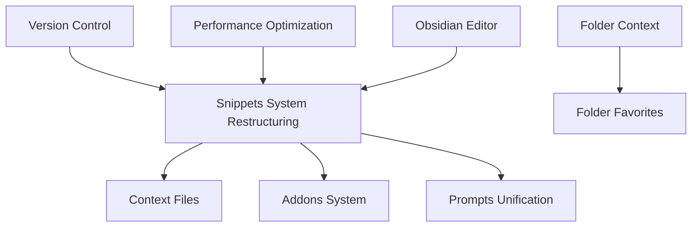

# 🚀 Implementation Plans Overview

Deze directory bevat alle implementation plans voor AirPrompts features. Elke feature heeft zijn eigen subdirectory met gedetailleerde documentatie.

## 📋 Current Implementation Plans

### 🔥 In Development

- **[Snippets System Restructuring](./snippets-system-restructuring/)** - Unificatie van templates + snippets naar prompts systeem, plus context files en addons
  - Status: 🟡 Planning Phase
  - Priority: High
  - Target: Q1 2025

### ✅ Completed

- **[Folder Favorites](./folder-favorites/)** - Folder-specific favorites systeem
  - Status: ✅ Implemented
  - Completed: 2024

- **[Todo System](./todo-system/)** - Geïntegreerd todo management
  - Status: ✅ Implemented
  - Completed: 2024

- **[Folder Drag & Drop](./folder-drag-drop/)** - Drag & drop folder management
  - Status: ✅ Implemented
  - Completed: 2024

### 📋 Planned

- **[Folder Context](./folder-context/)** - Context-aware folder systeem
  - Status: 🟡 Planned
  - Priority: Medium

- **[Obsidian Editor](./obsidian-editor/)** - Obsidian-style editor integratie
  - Status: 🟡 Planned
  - Priority: Low

- **[Version Control](./version-control/)** - Version control voor templates/workflows
  - Status: 🟡 Planned
  - Priority: Medium

- **[Performance Optimization](./performance-optimization/)** - App performance verbeteringen
  - Status: 🔄 Ongoing
  - Priority: High

## 🔗 Dependencies Map

## 📊 Implementation Status Legend

- 🔴 **Blocked** - Cannot proceed due to dependencies
- 🟡 **Planned** - Ready to start, not yet begun
- 🔵 **In Progress** - Active development
- ✅ **Completed** - Fully implemented and tested
- 🔄 **Ongoing** - Continuous improvement

## 🛠️ How to Use This Documentation

1. **For New Features**: Create new subdirectory with descriptive name
2. **For Planning**: Start with `README.md` in feature folder
3. **For Implementation**: Follow the established documentation patterns
4. **For Updates**: Update status in this central index

## 📝 Documentation Templates

Each implementation plan should contain:

- `README.md` - Feature overview and navigation
- `requirements.md` - Functional and technical requirements
- `architecture.md` - Technical design and architecture
- `implementation-phases.md` - Phased implementation plan
- `database-changes.md` - Database schema modifications (if applicable)
- `api-changes.md` - API endpoint changes (if applicable)
- `frontend-changes.md` - UI/UX changes (if applicable)
- `testing-strategy.md` - Testing approach
- `rollback-plan.md` - Rollback strategy

## 🔄 Update Process

When updating implementation status:

1. Update status in this central README
2. Update target dates if changed
3. Add any new dependencies discovered
4. Link to relevant PRs/commits when completed

---

**Last Updated**: 2025-01-29  
**Maintained By**: Development Team
