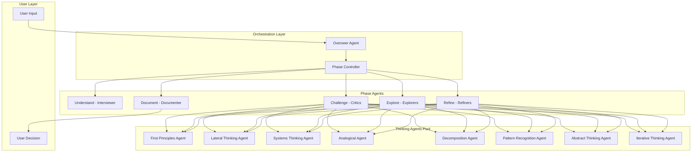

# 🧠 Overseer Agent System - AI Think Tank

## 📋 Overview

Een revolutionair multi-agent systeem waarbij een **Overseer Agent** verschillende gespecialiseerde "thinking agents" orkestreert om complexe problemen vanuit meerdere perspectieven te analyseren. Dit systeem fungeert als een AI Think Tank met de gebruiker als eindverantwoordelijke beslisser.

## 🎯 Core Concept

### De Visie

> "Een perfecte sparringspartner die erg kritisch is, out-of-the-box denkt en dingen van verschillende perspectieven bekijkt. De user blijft de baas en maakt de beslissingen - de agent geeft suggesties en documenteert het idee."

### Kernprincipes

1. **User Agency**: De gebruiker blijft altijd de beslisser
2. **Multi-Perspective Analysis**: Elk probleem wordt vanuit meerdere denkstijlen bekeken
3. **Kritisch & Constructief**: Proactief zwakke punten identificeren EN alternatieven voorstellen
4. **Gestructureerd Proces**: Vaste flow van understand → challenge → explore → refine → document
5. **Transparante Documentatie**: Alle denkprocessen worden vastgelegd

## 🏗️ System Architecture

### Agent Hiërarchie



### Agent Types & Modes

Elke thinking agent heeft twee modes:

- **Creative Mode**: Experimenteel, innovatief, buiten de lijntjes
- **Realistic Mode**: Praktisch, haalbaar, binnen constraints

Dit geeft 16 mogelijke agent configuraties (8 agents × 2 modes).

## 🔄 Process Flow

### Phase 1: Understand

**Lead Agent**: Interviewer  
**Doel**: Volledig begrip krijgen van het idee/probleem

**Interviewer Agent Vragen**:

- Wat is het hoofddoel?
- Welke problemen lost dit op?
- Wie zijn de stakeholders?
- Wat zijn de success criteria?
- Welke constraints zijn er?

**Output**: Gestructureerde task summary

### Phase 2: Challenge

**Lead Agents**: Multiple Critical Thinking Agents  
**Doel**: Assumptions uitdagen, zwakke punten identificeren

**Overseer Selecteert Agents Gebaseerd Op**:

- Type probleem (technical, business, UX)
- Complexiteit
- Stakeholder concerns

**Output**: Lijst van challenges, assumptions, risico's

### Phase 3: Explore

**Lead Agents**: Explorer Agents  
**Doel**: Alternatieve oplossingen genereren

**Exploratie Richtingen**:

- Verschillende implementatie approaches
- Trade-off analyses
- "What if" scenarios
- Best practices uit andere domeinen

**Output**: Meerdere oplossingsrichtingen met voor/nadelen

### Phase 4: Refine

**Lead Agents**: Refiner Agents  
**Doel**: Gekozen richting optimaliseren

**Refinement Focus**:

- Detail uitwerking
- Edge cases
- Performance optimalisaties
- Security overwegingen
- Scalability planning

**Output**: Geoptimaliseerd plan/design

### Phase 5: Document

**Lead Agent**: Documenter  
**Doel**: Alles vastleggen in gestructureerde markdown

**Documentatie Bevat**:

- Final concept
- Thinking journey (alle overwegingen)
- Decision rationale
- Implementation roadmap
- Open questions / follow-ups

## 📁 Output Structure

```
/docs/ai-think-tank/
├── {project-name}/
│   ├── ideas/
│   │   └── {timestamp}-{topic}/
│   │       ├── final-concept.md         # Eindresultaat
│   │       ├── thinking-journey.md      # Volledig denkproces
│   │       └── agent-outputs/           # Raw agent outputs
│   │           ├── understand-interviewer.md
│   │           ├── challenge-firstprinciples.md
│   │           ├── challenge-systems.md
│   │           ├── explore-lateral.md
│   │           └── refine-decomposition.md
│   ├── bugs/
│   ├── features/
│   ├── architecture/
│   └── implementation-plans/
```

## 🎮 Usage Example

```markdown
User: "Ik wil een notification systeem bouwen voor mijn app"

Overseer: "Ik ga dit idee analyseren met mijn AI Think Tank. We doorlopen 5 fases:

### Phase 1: UNDERSTAND

_Spawning Interviewer Agent..._

Interviewer: "Laten we dit concept uitdiepen:

1. Wat voor soort notifications? (push, in-app, email, sms?)
2. Wie zijn de ontvangers? (users, admins, system?)
3. Wat triggers notifications? (events, tijd, user actions?)
4. Volume verwachtingen? (aantal per dag/user?)
5. Real-time vereisten?"

User: [antwoorden...]

### Phase 2: CHALLENGE

_Spawning Systems Thinking Agent (Realistic) & First Principles Agent (Creative)..._

Systems Agent: "Ik zie potentiële bottlenecks:

- Notification storm bij systeem events
- Message queue overflow scenarios
- Cross-platform delivery challenges"

First Principles Agent: "Waarom notifications? Misschien is een event log met filters beter?
Users kunnen zelf kiezen wat belangrijk is..."

### Phase 3: EXPLORE

[etc...]
```

## 🚀 Benefits

### Voor de Gebruiker

- **360° Perspectief**: Geen blinde vlekken door multi-agent analyse
- **Gestructureerd Denkproces**: Chaos wordt ordening
- **Traceerbare Beslissingen**: Waarom keuzes gemaakt zijn
- **Leerervaring**: Nieuwe denkwijzen ontdekken

### Voor Development

- **Betere Requirements**: Doordat alles uitgevraagd wordt
- **Risico Reductie**: Problemen vroeg geïdentificeerd
- **Innovatie**: Creative agents suggereren onverwachte oplossingen
- **Documentatie**: Automatisch gegenereerd en compleet

## 🔗 Integration Points

- **Context Files**: Agents kunnen uploaded files analyseren
- **Prompts System**: Agents kunnen prompts genereren voor verdere exploratie
- **Workflows**: Multi-step processes kunnen door Think Tank geanalyseerd worden

## 🎯 Success Metrics

- **Idee Kwaliteit**: Beter doordachte concepten
- **Decision Speed**: Sneller tot goede beslissingen
- **Innovation Rate**: Meer creative oplossingen
- **Documentation Quality**: Complete, traceerbare documentatie

---

**Status**: 🟡 Concept Design Phase  
**Priority**: High  
**Next Steps**:

1. Design thinking agents in detail
2. Create phase controller logic
3. Build MVP met 2-3 agents
4. Test met real-world scenarios
