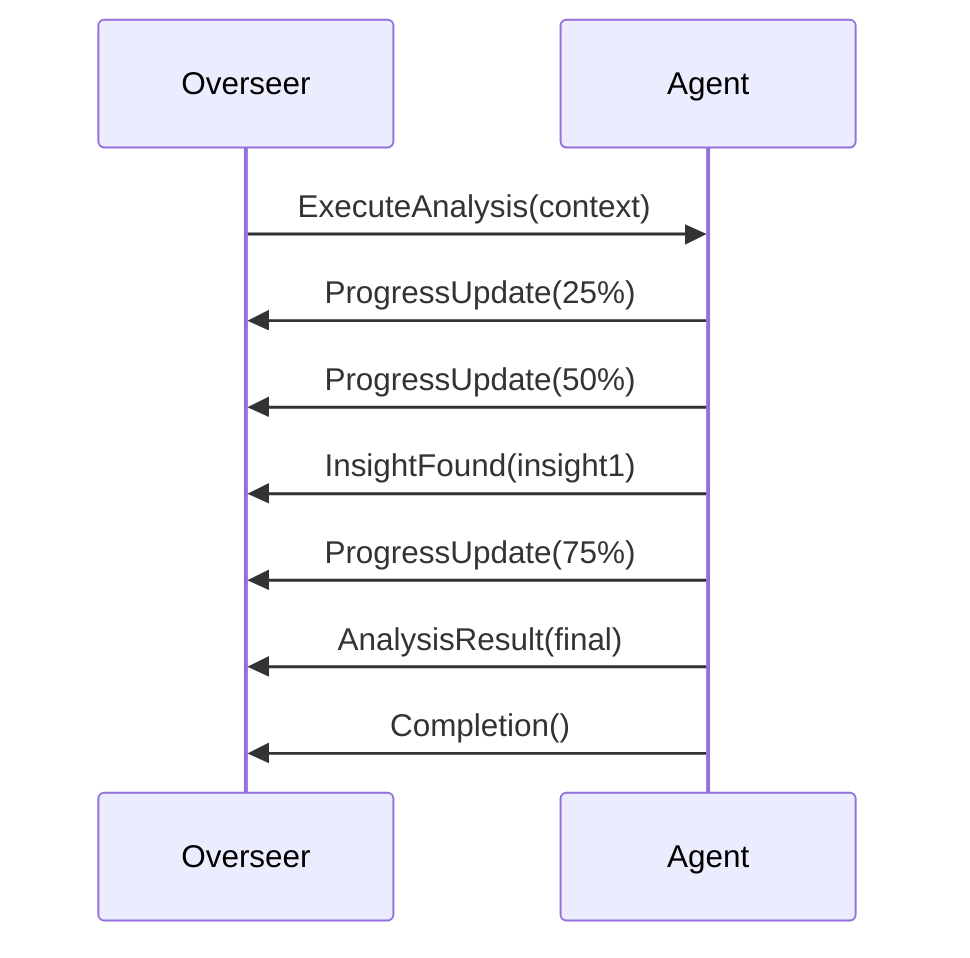
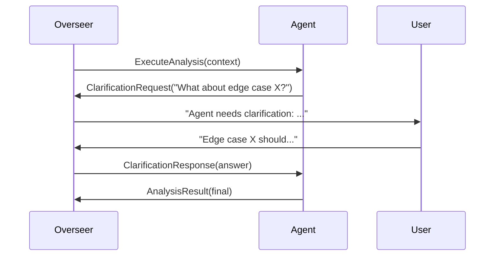
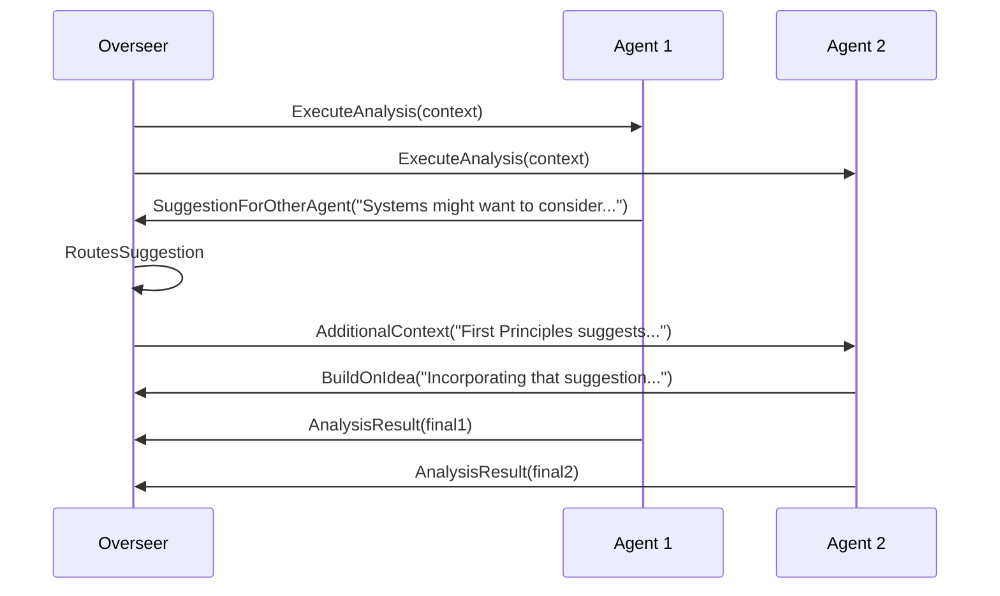

# 🔌 Agent Communication Protocol

## 📋 Overview

Definieert hoe agents communiceren met de Overseer en indirect met elkaar. Agents kunnen NIET direct met elkaar communiceren - alle communicatie loopt via de Overseer voor betere control en coherentie.

## 🎯 Communication Principles

### Core Rules

1. **Hub-and-Spoke Model**: Overseer is centrale hub, agents zijn spokes
2. **No Direct Agent-to-Agent**: Voorkomt chaos en conflicten
3. **Structured Messages**: Alle communicatie volgt strict format
4. **Async by Default**: Non-blocking communication
5. **Traceable**: Alle messages worden gelogged

### Why This Architecture?

- **Control**: Overseer behoudt overzicht en control
- **Coherence**: Voorkomt tegenstrijdige instructies
- **Debugging**: Makkelijker te traceren wat gebeurt
- **Resource Management**: Overseer kan prioriteren
- **Security**: Agents kunnen elkaar niet beïnvloeden

## 📨 Message Structure

### Base Message Format

```typescript
interface AgentMessage {
  // Identification
  id: string; // Unique message ID
  sessionId: string; // Think tank session ID

  // Routing
  from: AgentIdentifier; // Sender details
  to: 'overseer' | AgentIdentifier; // Always 'overseer' for agents

  // Content
  type: MessageType; // Type of message
  payload: any; // Message content

  // Metadata
  timestamp: ISO8601; // When sent
  phase: PhaseType; // Current phase
  priority: Priority; // Message priority
  confidence: number; // 0-1 confidence score

  // Threading
  inReplyTo?: string; // Reference to previous message
  threadId?: string; // Conversation thread
}

interface AgentIdentifier {
  agentType: string; // 'first-principles', 'lateral', etc
  agentId: string; // Unique instance ID
  mode: 'creative' | 'realistic';
}
```

### Message Types

```typescript
enum MessageType {
  // Analysis Messages
  ANALYSIS_RESULT = 'analysis_result',
  INSIGHT = 'insight',
  CHALLENGE = 'challenge',
  SOLUTION = 'solution',
  REFINEMENT = 'refinement',

  // Question Messages
  CLARIFICATION_REQUEST = 'clarification_request',
  ADDITIONAL_CONTEXT_REQUEST = 'additional_context_request',
  USER_INPUT_REQUEST = 'user_input_request',

  // Status Messages
  PROGRESS_UPDATE = 'progress_update',
  WARNING = 'warning',
  ERROR = 'error',
  COMPLETION = 'completion',

  // Collaboration Hints
  SUGGESTION_FOR_OTHER_AGENT = 'suggestion_for_other_agent',
  BUILD_ON_IDEA = 'build_on_idea',
  CONTRADICTION_FOUND = 'contradiction_found',
}

enum Priority {
  CRITICAL = 'critical', // Blocks progress
  HIGH = 'high', // Important insight
  NORMAL = 'normal', // Regular communication
  LOW = 'low', // FYI only
}
```

## 🔄 Communication Patterns

### 1. Basic Analysis Flow



### 2. Clarification Request



### 3. Inter-Agent Collaboration (Via Overseer)



## 💬 Message Examples

### Analysis Result Message

```javascript
{
  id: "msg_12345",
  sessionId: "session_abc",
  from: {
    agentType: "first-principles",
    agentId: "fp_instance_789",
    mode: "creative"
  },
  to: "overseer",
  type: "ANALYSIS_RESULT",
  payload: {
    summary: "Breaking down notification system to fundamentals",
    fundamentals: [
      "Information transfer",
      "Attention management",
      "Time sensitivity"
    ],
    insights: [
      {
        insight: "Notifications are really about attention economics",
        confidence: 0.9,
        implications: ["Should optimize for attention budget"]
      }
    ],
    recommendations: [
      "Consider attention as finite resource",
      "Implement notification budgeting"
    ]
  },
  timestamp: "2024-01-29T10:30:00Z",
  phase: "CHALLENGE",
  priority: "HIGH",
  confidence: 0.85
}
```

### Clarification Request Message

```javascript
{
  id: "msg_23456",
  sessionId: "session_abc",
  from: {
    agentType: "systems-thinking",
    agentId: "st_instance_234",
    mode: "realistic"
  },
  to: "overseer",
  type: "CLARIFICATION_REQUEST",
  payload: {
    question: "How should the system handle notification delivery failures?",
    context: "Analyzing failure modes and recovery strategies",
    options: [
      "Retry with exponential backoff",
      "Dead letter queue",
      "Ignore and log",
      "Alert operations team"
    ],
    preference: "Retry with exponential backoff",
    reason: "Standard pattern for distributed systems"
  },
  timestamp: "2024-01-29T10:32:00Z",
  phase: "REFINE",
  priority: "HIGH",
  confidence: 0.7
}
```

### Collaboration Hint Message

```javascript
{
  id: "msg_34567",
  sessionId: "session_abc",
  from: {
    agentType: "lateral-thinking",
    agentId: "lt_instance_567",
    mode: "creative"
  },
  to: "overseer",
  type: "SUGGESTION_FOR_OTHER_AGENT",
  payload: {
    targetAgentType: "systems-thinking",
    suggestion: "What if notifications had a 'half-life' like radioactive decay?",
    reasoning: "Older notifications become less important over time naturally",
    possibleApplication: "Priority calculation algorithm"
  },
  timestamp: "2024-01-29T10:33:00Z",
  phase: "EXPLORE",
  priority: "NORMAL",
  confidence: 0.6
}
```

## 🎮 Overseer Message Handling

### Message Router

```javascript
class OverseerMessageRouter {
  constructor(overseer) {
    this.overseer = overseer;
    this.messageQueue = new PriorityQueue();
    this.activeThreads = new Map();
    this.messageLog = [];
  }

  async handleAgentMessage(message) {
    // Log all messages
    this.logMessage(message);

    // Validate message
    this.validateMessage(message);

    // Route based on type
    switch (message.type) {
      case MessageType.ANALYSIS_RESULT:
        return this.handleAnalysisResult(message);

      case MessageType.CLARIFICATION_REQUEST:
        return this.handleClarificationRequest(message);

      case MessageType.SUGGESTION_FOR_OTHER_AGENT:
        return this.handleAgentSuggestion(message);

      case MessageType.ERROR:
        return this.handleError(message);

      default:
        return this.handleGenericMessage(message);
    }
  }

  async handleAgentSuggestion(message) {
    const { targetAgentType, suggestion } = message.payload;

    // Find target agent if active
    const targetAgent = this.overseer.findActiveAgent(targetAgentType);

    if (targetAgent) {
      // Create context message for target
      const contextMessage = {
        id: generateId(),
        type: 'ADDITIONAL_CONTEXT',
        from: 'overseer',
        to: targetAgent.id,
        payload: {
          source: message.from.agentType,
          suggestion: suggestion,
          originalMessage: message,
        },
      };

      // Queue for delivery
      this.queueMessageForAgent(targetAgent, contextMessage);
    } else {
      // Store for future reference
      this.storeSuggestionForLater(message);
    }
  }
}
```

### Message Aggregation

```javascript
class MessageAggregator {
  aggregatePhaseMessages(messages, phase) {
    const aggregated = {
      phase: phase,
      messageCount: messages.length,
      byType: this.groupByType(messages),
      byAgent: this.groupByAgent(messages),
      timeline: this.createTimeline(messages),
      keyInsights: this.extractKeyInsights(messages),
      consensusPoints: this.findConsensus(messages),
      conflicts: this.findConflicts(messages),
    };

    return aggregated;
  }

  extractKeyInsights(messages) {
    return messages
      .filter((m) => m.type === 'INSIGHT' || m.type === 'ANALYSIS_RESULT')
      .map((m) => ({
        agent: m.from.agentType,
        insight: m.payload.summary || m.payload.insight,
        confidence: m.confidence,
      }))
      .sort((a, b) => b.confidence - a.confidence)
      .slice(0, 5); // Top 5 insights
  }

  findConflicts(messages) {
    const conflicts = [];

    // Simple conflict detection
    messages.forEach((m1, i) => {
      messages.slice(i + 1).forEach((m2) => {
        if (this.messagesConflict(m1, m2)) {
          conflicts.push({
            agent1: m1.from.agentType,
            agent2: m2.from.agentType,
            topic: this.extractTopic(m1, m2),
            position1: m1.payload.summary,
            position2: m2.payload.summary,
          });
        }
      });
    });

    return conflicts;
  }
}
```

## 🔒 Security & Validation

### Message Validation

```javascript
class MessageValidator {
  validate(message) {
    // Required fields
    this.validateRequired(message, [
      'id',
      'sessionId',
      'from',
      'to',
      'type',
      'payload',
      'timestamp',
    ]);

    // From field validation
    this.validateAgentIdentifier(message.from);

    // To field must be 'overseer' for agent messages
    if (message.from.agentType !== 'overseer' && message.to !== 'overseer') {
      throw new Error('Agents can only send messages to overseer');
    }

    // Payload size limits
    const payloadSize = JSON.stringify(message.payload).length;
    if (payloadSize > 50000) {
      // 50KB limit
      throw new Error('Message payload too large');
    }

    // Timestamp validation
    this.validateTimestamp(message.timestamp);

    // Type validation
    if (!Object.values(MessageType).includes(message.type)) {
      throw new Error(`Invalid message type: ${message.type}`);
    }
  }
}
```

### Message Sanitization

```javascript
class MessageSanitizer {
  sanitize(message) {
    // Remove any executable code
    message.payload = this.removeExecutableCode(message.payload);

    // Truncate long strings
    message.payload = this.truncateLongStrings(message.payload, 10000);

    // Remove sensitive information
    message.payload = this.removeSensitiveInfo(message.payload);

    return message;
  }

  removeExecutableCode(obj) {
    // Recursively clean object
    if (typeof obj === 'string') {
      // Remove script tags, eval, etc
      return obj.replace(/<script[^>]*>.*?<\/script>/gi, '').replace(/eval\s*\(/g, 'eval_removed(');
    }
    // ... handle other types
  }
}
```

## 📊 Communication Metrics

### Message Analytics

```javascript
class CommunicationAnalytics {
  constructor() {
    this.metrics = {
      totalMessages: 0,
      messagesByType: {},
      messagesByAgent: {},
      averageResponseTime: 0,
      clarificationRate: 0,
      errorRate: 0,
    };
  }

  trackMessage(message) {
    this.metrics.totalMessages++;

    // By type
    this.metrics.messagesByType[message.type] =
      (this.metrics.messagesByType[message.type] || 0) + 1;

    // By agent
    const agentKey = `${message.from.agentType}-${message.from.mode}`;
    this.metrics.messagesByAgent[agentKey] = (this.metrics.messagesByAgent[agentKey] || 0) + 1;

    // Calculate rates
    this.updateRates();
  }

  getCommunicationReport() {
    return {
      summary: {
        totalMessages: this.metrics.totalMessages,
        uniqueAgents: Object.keys(this.metrics.messagesByAgent).length,
        mostActiveAgent: this.getMostActiveAgent(),
        clarificationRate: `${(this.metrics.clarificationRate * 100).toFixed(1)}%`,
        errorRate: `${(this.metrics.errorRate * 100).toFixed(1)}%`,
      },
      details: this.metrics,
    };
  }
}
```

## 🚀 Advanced Features

### Message Priorities & Queueing

```javascript
class MessagePriorityQueue {
  constructor() {
    this.queues = {
      [Priority.CRITICAL]: [],
      [Priority.HIGH]: [],
      [Priority.NORMAL]: [],
      [Priority.LOW]: [],
    };
  }

  enqueue(message) {
    const priority = message.priority || Priority.NORMAL;
    this.queues[priority].push(message);
  }

  dequeue() {
    // Process in priority order
    for (const priority of [Priority.CRITICAL, Priority.HIGH, Priority.NORMAL, Priority.LOW]) {
      if (this.queues[priority].length > 0) {
        return this.queues[priority].shift();
      }
    }
    return null;
  }
}
```

### Conversation Threading

```javascript
class ConversationThreadManager {
  constructor() {
    this.threads = new Map();
  }

  addToThread(message) {
    const threadId = message.threadId || message.inReplyTo || message.id;

    if (!this.threads.has(threadId)) {
      this.threads.set(threadId, {
        id: threadId,
        messages: [],
        participants: new Set(),
        topic: this.extractTopic(message),
        status: 'active',
      });
    }

    const thread = this.threads.get(threadId);
    thread.messages.push(message);
    thread.participants.add(message.from.agentId);

    return thread;
  }

  getThreadSummary(threadId) {
    const thread = this.threads.get(threadId);
    if (!thread) return null;

    return {
      id: thread.id,
      messageCount: thread.messages.length,
      participants: Array.from(thread.participants),
      duration: this.calculateDuration(thread),
      keyPoints: this.extractKeyPoints(thread),
      resolution: thread.resolution || 'ongoing',
    };
  }
}
```

## 🔧 Implementation Guidelines

### Do's

- ✅ Always validate messages before processing
- ✅ Use structured message types
- ✅ Include confidence scores
- ✅ Thread related messages
- ✅ Log all communications
- ✅ Handle timeouts gracefully

### Don'ts

- ❌ Don't allow direct agent-to-agent messaging
- ❌ Don't send executable code in messages
- ❌ Don't exceed message size limits
- ❌ Don't ignore message priorities
- ❌ Don't lose messages in transit

---

**Next Steps**:

1. Implement message validation
2. Create message router
3. Build priority queue system
4. Test with multi-agent scenarios
