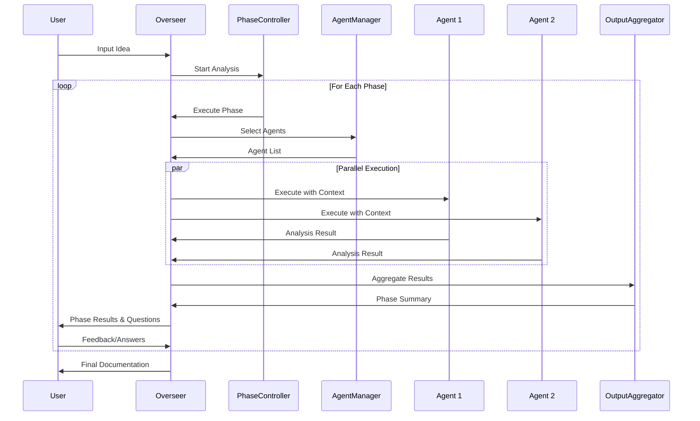

# 🏗️ Overseer Agent System - Technical Architecture

## 📋 Overview

Technische architectuur voor het multi-agent AI Think Tank systeem. Dit document beschrijft hoe de Overseer Agent sub-agents spawnt, beheert en hun output aggregeert tot coherente insights.

## 🎯 Core Architecture Principles

### 1. **Modular Agent Design**

- Elke agent is een onafhankelijke module
- Agents communiceren alleen via de Overseer
- Geen directe inter-agent communicatie
- Stateless agents voor schaalbaarheid

### 2. **Resource Management**

- Agent spawning budget per sessie
- Timeout protection per agent
- Memory limits voor agent execution
- Concurrent execution limits

### 3. **Context Isolation**

- Elke agent krijgt gefilterde context
- No global state pollution
- Clean slate per execution
- Output sanitization

## 🔧 Technical Components

### Overseer Agent Core

```javascript
class OverseerAgent {
  constructor(config) {
    this.phaseController = new PhaseController();
    this.agentRegistry = new AgentRegistry();
    this.contextManager = new ContextManager();
    this.outputAggregator = new OutputAggregator();
    this.resourceManager = new ResourceManager({
      maxConcurrentAgents: 5,
      maxTotalAgents: 20,
      timeoutPerAgent: 30000, // 30 seconds
      maxMemoryPerAgent: 256 * 1024 * 1024, // 256MB
    });
  }

  async analyzeIdea(userInput, projectContext) {
    const session = new ThinkTankSession(userInput, projectContext);

    // Execute phases sequentially
    for (const phase of this.phaseController.getPhases()) {
      const phaseResult = await this.executePhase(phase, session);
      session.addPhaseResult(phase.name, phaseResult);

      // User checkpoint - allow user to guide direction
      if (phase.requiresUserInput) {
        await this.getUserFeedback(session, phase);
      }
    }

    return session.generateFinalOutput();
  }

  async executePhase(phase, session) {
    // Determine which agents to spawn
    const agentSelection = this.selectAgentsForPhase(phase, session.getCurrentContext());

    // Check resource budget
    if (!this.resourceManager.canSpawnAgents(agentSelection.length)) {
      agentSelection = this.prioritizeAgents(agentSelection);
    }

    // Spawn and execute agents
    const agentPromises = agentSelection.map((agentConfig) =>
      this.spawnAndExecuteAgent(agentConfig, session.getCurrentContext())
    );

    // Collect results with timeout protection
    const results = await Promise.allSettled(agentPromises);

    // Aggregate outputs
    return this.outputAggregator.aggregate(results, phase.aggregationStrategy);
  }
}
```

### Agent Registry & Factory

```javascript
class AgentRegistry {
  constructor() {
    this.agents = new Map();
    this.registerDefaultAgents();
  }

  registerDefaultAgents() {
    // Thinking style agents
    this.register('first-principles', FirstPrinciplesAgent);
    this.register('lateral-thinking', LateralThinkingAgent);
    this.register('systems-thinking', SystemsThinkingAgent);
    this.register('analogical', AnalogicalAgent);
    this.register('decomposition', DecompositionAgent);
    this.register('pattern-recognition', PatternRecognitionAgent);
    this.register('abstract-thinking', AbstractThinkingAgent);
    this.register('iterative', IterativeAgent);

    // Phase-specific agents
    this.register('interviewer', InterviewerAgent);
    this.register('critic', CriticAgent);
    this.register('explorer', ExplorerAgent);
    this.register('refiner', RefinerAgent);
    this.register('documenter', DocumenterAgent);
  }

  createAgent(type, mode = 'realistic') {
    const AgentClass = this.agents.get(type);
    if (!AgentClass) {
      throw new Error(`Unknown agent type: ${type}`);
    }

    return new AgentClass({ mode });
  }
}
```

### Agent Base Class

```javascript
class BaseThinkingAgent {
  constructor({ mode = 'realistic' }) {
    this.mode = mode; // 'creative' or 'realistic'
    this.timeout = 30000; // 30 seconds default
    this.maxOutputLength = 5000; // characters
  }

  async execute(context, parameters = {}) {
    // Validate context
    this.validateContext(context);

    // Set execution timeout
    const timeoutPromise = new Promise((_, reject) =>
      setTimeout(() => reject(new Error('Agent timeout')), this.timeout)
    );

    // Execute analysis
    const analysisPromise = this.analyze(context, parameters);

    // Race between analysis and timeout
    try {
      const result = await Promise.race([analysisPromise, timeoutPromise]);
      return this.formatOutput(result);
    } catch (error) {
      return this.handleError(error);
    }
  }

  // Abstract methods to be implemented by specific agents
  async analyze(context, parameters) {
    throw new Error('analyze() must be implemented by subclass');
  }

  validateContext(context) {
    if (!context.userInput) {
      throw new Error('Missing user input in context');
    }
  }

  formatOutput(result) {
    return {
      agent: this.constructor.name,
      mode: this.mode,
      timestamp: new Date().toISOString(),
      analysis: result,
      confidence: this.calculateConfidence(result),
      keyPoints: this.extractKeyPoints(result),
    };
  }
}
```

### Thinking Agent Implementation Example

```javascript
class FirstPrinciplesAgent extends BaseThinkingAgent {
  async analyze(context, parameters) {
    const { userInput, projectContext } = context;

    if (this.mode === 'creative') {
      return this.creativeAnalysis(userInput, projectContext);
    } else {
      return this.realisticAnalysis(userInput, projectContext);
    }
  }

  async creativeAnalysis(input, projectContext) {
    // Break down to absolute fundamentals, then rebuild creatively
    const fundamentals = this.extractFundamentals(input);

    return {
      fundamentals: fundamentals,
      assumptions: this.identifyAssumptions(input),
      challengedAssumptions: fundamentals.map((f) => ({
        fundamental: f,
        whatIf: this.generateWhatIf(f),
        alternative: this.proposeAlternative(f),
      })),
      creativeReconstruction: this.rebuildCreatively(fundamentals),
      moonshot: this.generateMoonshotIdea(fundamentals),
    };
  }

  async realisticAnalysis(input, projectContext) {
    // Break down to fundamentals within real constraints
    const fundamentals = this.extractFundamentals(input);
    const constraints = this.identifyConstraints(projectContext);

    return {
      fundamentals: fundamentals,
      constraints: constraints,
      validAssumptions: this.validateAssumptions(input, constraints),
      practicalApproach: this.buildPracticalSolution(fundamentals, constraints),
      risks: this.identifyRisks(fundamentals, constraints),
    };
  }

  extractFundamentals(input) {
    // Logic to break down input to core components
    // Example: "notification system" → "user", "event", "message", "delivery"
    return [];
  }
}
```

### Context Management

```javascript
class ContextManager {
  constructor() {
    this.maxContextSize = 50000; // characters
    this.contextLayers = new Map();
  }

  prepareContextForAgent(agentType, fullContext, phase) {
    // Start with base context
    let agentContext = {
      userInput: fullContext.userInput,
      phase: phase.name,
      previousPhases: this.summarizePreviousPhases(fullContext),
    };

    // Add agent-specific context based on type
    switch (agentType) {
      case 'first-principles':
        agentContext.focusOn = 'fundamentals';
        agentContext.abstractionLevel = 'high';
        break;

      case 'systems-thinking':
        agentContext.focusOn = 'interactions';
        agentContext.includeSystemMap = true;
        break;

      case 'lateral-thinking':
        agentContext.focusOn = 'alternatives';
        agentContext.includeAnalogies = true;
        break;
    }

    // Compress if needed
    if (JSON.stringify(agentContext).length > this.maxContextSize) {
      agentContext = this.compressContext(agentContext);
    }

    return agentContext;
  }

  summarizePreviousPhases(fullContext) {
    // Create concise summary of previous phase outputs
    return fullContext.phaseResults.map((phase) => ({
      phase: phase.name,
      keyInsights: phase.keyInsights,
      decisions: phase.decisions,
    }));
  }
}
```

### Output Aggregation

```javascript
class OutputAggregator {
  aggregate(agentResults, strategy = 'synthesize') {
    // Filter out failed agents
    const successfulResults = agentResults
      .filter((r) => r.status === 'fulfilled')
      .map((r) => r.value);

    switch (strategy) {
      case 'synthesize':
        return this.synthesizeOutputs(successfulResults);

      case 'vote':
        return this.democraticVoting(successfulResults);

      case 'contrast':
        return this.contrastPerspectives(successfulResults);

      case 'converge':
        return this.findConvergence(successfulResults);

      default:
        return this.defaultAggregation(successfulResults);
    }
  }

  synthesizeOutputs(results) {
    // Group by themes
    const themes = this.extractThemes(results);

    // Find consensus points
    const consensus = this.findConsensus(results);

    // Identify unique insights
    const uniqueInsights = this.findUniqueInsights(results);

    // Compile conflicts
    const conflicts = this.identifyConflicts(results);

    return {
      summary: this.generateSummary(themes, consensus),
      themes: themes,
      consensus: consensus,
      uniqueInsights: uniqueInsights,
      conflicts: conflicts,
      agentContributions: results.map((r) => ({
        agent: r.agent,
        keyContribution: r.keyPoints[0],
        confidence: r.confidence,
      })),
    };
  }
}
```

### Resource Management

```javascript
class ResourceManager {
  constructor(limits) {
    this.limits = limits;
    this.currentUsage = {
      activeAgents: 0,
      totalAgentsSpawned: 0,
      memoryUsed: 0,
      cpuTime: 0,
    };
  }

  async allocateResources(agentType) {
    // Check if we can spawn another agent
    if (this.currentUsage.activeAgents >= this.limits.maxConcurrentAgents) {
      throw new Error('Concurrent agent limit reached');
    }

    if (this.currentUsage.totalAgentsSpawned >= this.limits.maxTotalAgents) {
      throw new Error('Total agent limit reached for session');
    }

    // Allocate resources
    const allocation = {
      memory: this.limits.maxMemoryPerAgent,
      timeout: this.limits.timeoutPerAgent,
      priority: this.calculatePriority(agentType),
    };

    this.currentUsage.activeAgents++;
    this.currentUsage.totalAgentsSpawned++;

    return allocation;
  }

  releaseResources(allocation) {
    this.currentUsage.activeAgents--;
    // Log resource usage for monitoring
    this.logResourceUsage(allocation);
  }
}
```

### Agent Communication Protocol

```javascript
class AgentMessage {
  constructor(type, payload, metadata = {}) {
    this.id = generateId();
    this.type = type; // 'analysis', 'question', 'suggestion', 'warning'
    this.payload = payload;
    this.metadata = {
      timestamp: new Date().toISOString(),
      agentId: metadata.agentId,
      phase: metadata.phase,
      confidence: metadata.confidence || 0.5,
      ...metadata,
    };
  }
}

class AgentCommunicationBus {
  constructor(overseer) {
    this.overseer = overseer;
    this.messages = [];
    this.subscribers = new Map();
  }

  // Agents can only send to overseer, not to each other
  sendToOverseer(agentId, message) {
    this.messages.push({
      from: agentId,
      to: 'overseer',
      message: message,
      timestamp: Date.now(),
    });

    this.overseer.handleAgentMessage(agentId, message);
  }

  // Overseer can broadcast to specific agents
  broadcastToAgents(agentIds, message) {
    agentIds.forEach((agentId) => {
      if (this.subscribers.has(agentId)) {
        const handler = this.subscribers.get(agentId);
        handler(message);
      }
    });
  }
}
```

## 🔄 Execution Flow

### Phase Execution Pipeline



## 🎮 Configuration Options

### Session Configuration

```yaml
overseer_config:
  phases:
    understand:
      agents: ['interviewer']
      user_checkpoint: true
      timeout: 60000

    challenge:
      agents: ['first-principles', 'systems-thinking', 'lateral-thinking']
      mode_selection: 'auto' # auto, creative, realistic, both
      parallel_execution: true

    explore:
      agents: ['lateral-thinking-creative', 'analogical-creative']
      max_alternatives: 5

    refine:
      agents: ['decomposition', 'pattern-recognition']
      focus: ['performance', 'security', 'scalability']

    document:
      agents: ['documenter']
      output_format: 'markdown'
      include_journey: true

  resource_limits:
    max_concurrent_agents: 5
    max_total_agents: 20
    timeout_per_agent: 30000
    max_memory_per_agent: 268435456 # 256MB

  output_preferences:
    aggregation_strategy: 'synthesize'
    include_raw_outputs: false
    confidence_threshold: 0.6
```

## 🔒 Security Considerations

### Agent Isolation

- Agents run in isolated contexts
- No access to system resources
- Restricted network access
- Sandboxed execution environment

### Input Validation

- User input sanitization
- Context size limits
- Injection attack prevention
- Output filtering

### Resource Protection

- Memory limits enforced
- CPU time tracking
- Timeout protection
- Rate limiting per user

## 📊 Performance Optimization

### Caching Strategy

```javascript
class AgentResultCache {
  constructor() {
    this.cache = new LRUCache({
      max: 1000,
      ttl: 1000 * 60 * 60, // 1 hour
    });
  }

  getCacheKey(agentType, context, parameters) {
    const contextHash = this.hashContext(context);
    return `${agentType}:${contextHash}:${JSON.stringify(parameters)}`;
  }

  async getOrExecute(agent, context, parameters) {
    const cacheKey = this.getCacheKey(agent.type, context, parameters);

    if (this.cache.has(cacheKey)) {
      return this.cache.get(cacheKey);
    }

    const result = await agent.execute(context, parameters);
    this.cache.set(cacheKey, result);

    return result;
  }
}
```

### Parallel Processing

- Maximum 5 concurrent agents
- Dynamic batching based on system load
- Priority queuing for critical agents
- Graceful degradation under load

## 🧪 Testing Strategy

### Unit Tests

- Individual agent behavior
- Output aggregation logic
- Resource management
- Context preparation

### Integration Tests

- Full phase execution
- Multi-agent coordination
- User interaction flow
- Error handling

### Performance Tests

- Agent execution time
- Memory usage patterns
- Concurrent execution limits
- Cache effectiveness

---

**Next Steps**:

1. Implement base agent framework
2. Create first 3 thinking agents
3. Build phase controller
4. Test with simple scenarios
