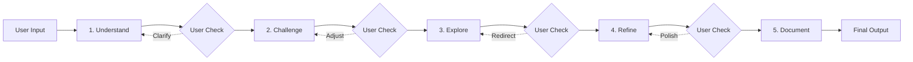

# 🔄 Overseer Agent Process Flow

## 📋 Overview

Gedetailleerde beschrijving van de 5-fase process flow die de Overseer Agent volgt: **Understand → Challenge → Explore → Refine → Document**. Elke fase heeft specifieke doelen, agents, en outputs.

## 🎯 Process Philosophy

### Core Principles

1. **User-Driven**: User blijft altijd in control
2. **Iterative**: Terug kunnen naar eerdere fases
3. **Transparent**: Alle denkstappen zijn zichtbaar
4. **Adaptive**: Process past zich aan aan probleem type
5. **Time-Conscious**: Geen artificial deadlines, user bepaalt tempo

### Flow Characteristics

- **Sequential by Default**: Fases volgen elkaar op
- **Parallel within Phases**: Agents binnen een fase kunnen parallel
- **Checkpoint-Based**: User feedback momenten tussen fases
- **Context Accumulation**: Elke fase bouwt voort op vorige

## 📊 Phase Overview



## 🔍 Phase 1: UNDERSTAND

### Purpose

Volledig begrip krijgen van het idee, probleem, of vraag van de user.

### Lead Agent

**Interviewer Agent** - Specialized in asking clarifying questions

### Process

```yaml
understand_phase:
  duration: 'Until user satisfied'

  steps:
    1_initial_capture:
      action: 'Capture raw user input'
      output: 'Initial problem statement'

    2_interview:
      agent: 'Interviewer'
      questions:
        - context: "What's the broader context?"
        - goals: 'What are you trying to achieve?'
        - users: 'Who will use/be affected by this?'
        - constraints: 'What limitations exist?'
        - success: 'How do we measure success?'
        - timeline: "What's the timeline?"
        - resources: 'What resources are available?'
        - prior_attempts: "What's been tried before?"

    3_synthesis:
      action: 'Create structured summary'
      components:
        - problem_statement
        - goals_and_objectives
        - stakeholder_map
        - constraints_list
        - success_criteria

    4_validation:
      action: 'Present summary to user'
      question: 'Did I understand correctly?'
      iterate_until: 'User confirms understanding'
```

### Example Interaction

```markdown
User: "I want to build a notification system"

Interviewer: "I'd like to understand your notification system better:

1. **Context**: What type of application is this for?
2. **Notification Types**: What kinds of notifications? (push, email, in-app, SMS?)
3. **Volume**: How many notifications per day/user expected?
4. **Triggers**: What events trigger notifications?
5. **User Control**: Can users customize their preferences?
6. **Priority Levels**: Are all notifications equal priority?
7. **Delivery Guarantees**: Must notifications be delivered exactly once?
8. **Existing System**: Replacing something or building new?"

User: [provides answers]

Overseer: "Let me summarize my understanding:

- Building an in-app + email notification system
- For a SaaS project management tool
- ~50 notifications/user/day
- Triggered by: task updates, mentions, deadlines
- Users need granular preferences
- 3 priority levels (urgent, normal, low)
- At-least-once delivery is acceptable
- This is a new feature

Is this correct?"
```

### Output Format

```javascript
{
  phase: "understand",
  summary: {
    problem: "Notification system for SaaS PM tool",
    type: "feature_development",
    complexity: "medium",
    domain: "user_communication"
  },
  details: {
    functional_requirements: [...],
    non_functional_requirements: [...],
    stakeholders: [...],
    constraints: [...],
    success_metrics: [...]
  },
  interview_transcript: [...],
  confidence_score: 0.95
}
```

## 💥 Phase 2: CHALLENGE

### Purpose

Kritisch analyseren, assumptions uitdagen, zwakke punten identificeren.

### Agent Selection

Overseer selecteert 2-4 agents based op problem type:

- Technical problems: Systems Thinking, First Principles, Decomposition
- Creative problems: Lateral Thinking, Analogical, Abstract
- Bug fixing: Pattern Recognition, Systems Thinking, Decomposition

### Process

```yaml
challenge_phase:
  duration: '5-15 minutes typical'

  steps:
    1_agent_selection:
      action: 'Overseer analyzes problem type'
      output: 'Selected thinking agents'

    2_parallel_analysis:
      agents: ['selected_agents']
      mode_selection:
        if: 'high_risk'
        then: 'realistic'
        else: 'both'
      timeout: '5min per agent'

    3_synthesis:
      action: 'Aggregate challenges'
      categories:
        - assumptions_challenged
        - risks_identified
        - edge_cases_found
        - alternative_framings

    4_prioritization:
      action: 'Rank challenges by impact'
      output: 'Top 5 critical challenges'
```

### Example Challenge Output

```markdown
## Challenges Identified

### From Systems Thinking Agent:

- **Cascade Effect**: One delayed notification could trigger notification storm
- **Feedback Loop**: Users disabling notifications reduces engagement → more aggressive notifications → more users disable
- **Integration Complexity**: 17 different trigger points across the system

### From First Principles Agent:

- **Core Assumption**: "Users want to be notified" - What if they prefer to pull info?
- **Fundamental Question**: Is notification the right metaphor? Maybe "updates stream"?
- **Root Problem**: Information overload, not information absence

### From Lateral Thinking Agent:

- **Alternative**: What if notifications expire? Like Snapchat messages
- **Reversal**: What if users notify the system what they're interested in now?
- **Exaggeration**: What if we had 1000 notifications/second?

### Top 3 Critical Challenges:

1. 📊 Notification storm prevention (Systems)
2. 🤔 Pull vs Push paradigm (First Principles)
3. 🔄 User preference complexity (Systems)
```

## 🌐 Phase 3: EXPLORE

### Purpose

Genereren van meerdere oplossingsrichtingen, alternatieven verkennen.

### Lead Agents

Explorer agents in creative mode, vaak:

- Lateral Thinking (creative)
- Analogical Thinking (creative)
- Abstract Thinking (creative)

### Process

```yaml
explore_phase:
  duration: '10-20 minutes typical'

  steps:
    1_solution_generation:
      parallel_agents: 3-5
      mode: 'primarily_creative'
      constraints: 'acknowledge_from_challenge_phase'
      target: '3-5 distinct approaches each'

    2_cross_pollination:
      action: 'Combine ideas from different agents'
      method: 'Overseer identifies synergies'

    3_feasibility_quick_check:
      for_each: 'solution_direction'
      evaluate:
        - technical_feasibility
        - resource_requirements
        - risk_level
        - innovation_score

    4_presentation:
      format: 'solution_marketplace'
      includes:
        - name_and_description
        - pros_and_cons
        - implementation_sketch
        - example_scenario
```

### Example Exploration Output

```markdown
## Solution Directions Explored

### 🏗️ Option 1: Traditional Queue System

**Description**: Standard notification queue with preferences
**Pros**:

- Proven pattern
- Many libraries available
- Predictable behavior
  **Cons**:
- Notification fatigue risk
- Complex preference management
- Scaling challenges
  **Innovation**: ⭐⭐

### 🌊 Option 2: Smart Notification Stream

**Description**: AI-driven notification bundling and timing
**Pros**:

- Reduces interruptions
- Learns user patterns
- Self-optimizing
  **Cons**:
- ML complexity
- Training data needed
- Less predictable
  **Innovation**: ⭐⭐⭐⭐

### 📰 Option 3: Activity Feed Paradigm

**Description**: Pull-based feed users check when ready
**Pros**:

- User in control
- No interruption
- Simple to implement
  **Cons**:
- Might miss urgent items
- Requires habit change
- Less engagement?
  **Innovation**: ⭐⭐⭐

### 🎯 Option 4: Hybrid Smart/Manual

**Description**: AI suggests, user configures
**Pros**:

- Best of both worlds
- User education built-in
- Gradual optimization
  **Cons**:
- More complex UI
- Longer setup time
  **Innovation**: ⭐⭐⭐⭐

### 🚀 Option 5: Event Marketplace (Wild Card)

**Description**: Users "subscribe" to event types like newsletters
**Pros**:

- Completely new paradigm
- Empowers users
- Natural filtering
  **Cons**:
- Big mental model shift
- Needs careful UX
- Risk of missing important
  **Innovation**: ⭐⭐⭐⭐⭐
```

## 🔧 Phase 4: REFINE

### Purpose

Gekozen richting optimaliseren, details uitwerken, edge cases afhandelen.

### Lead Agents

Refiner agents, typically:

- Decomposition (realistic)
- Pattern Recognition (realistic)
- Systems Thinking (realistic)
- Iterative Thinking (realistic)

### Process

```yaml
refine_phase:
  duration: "15-30 minutes typical"

  prerequisite: "User has selected primary direction"

  steps:
    1_deep_dive:
      focus: "selected_solution"
      agents: ["decomposition", "pattern_recognition"]
      output: "detailed_component_breakdown"

    2_edge_case_analysis:
      identify:
        - failure_modes
        - boundary_conditions
        - performance_limits
        - security_concerns

    3_implementation_planning:
      create:
        - technical_architecture
        - data_models
        - api_design
        - ui_wireframes

    4_optimization:
      consider:
        - performance_optimizations
        - scalability_patterns
        - monitoring_strategy
        - rollback_plans

    5_final_review:
      checklist:
        - [] All challenges addressed?
        - [] All requirements met?
        - [] All risks mitigated?
        - [] Implementation path clear?
```

### Example Refinement Output

```markdown
## Refined Solution: Hybrid Smart/Manual System

### Architecture
```

┌─────────────────┐ ┌──────────────────┐
│ Event Sources │────▶│ Event Collector │
└─────────────────┘ └──────────────────┘
│
▼
┌──────────────────┐
│ ML Categorizer │
└──────────────────┘
│
┌──────┴──────┐
▼ ▼
┌──────────┐ ┌──────────────┐
│ Urgent │ │ Bundleable │
│ Queue │ │ Queue │
└──────────┘ └──────────────┘
│ │
▼ ▼
┌─────────────────────────┐
│ Delivery Engine │
│ (Email/Push/In-App) │
└─────────────────────────┘

````

### Component Details

#### Event Collector
- Rate limiting: 1000 events/second/user
- Deduplication window: 5 minutes
- Schema validation
- Event enrichment

#### ML Categorizer
- Initial rule-based system
- Gradual learning from user feedback
- Features: time, type, user state, historical interaction
- Fallback to manual rules

#### Smart Bundling Logic
```python
def should_bundle(event, user_context):
    if event.priority == 'urgent':
        return False

    if user_context.last_interaction < 5_minutes_ago:
        return True  # User is active, bundle

    if similar_events_in_queue(event) > 3:
        return True  # Prevent spam

    return event.type in user.bundle_preferences
````

### Edge Cases Handled

1. **Notification Storm**: Circuit breaker at 50 notifications/minute
2. **System Overload**: Graceful degradation to simple queue
3. **ML Failure**: Fallback to rule-based system
4. **User Preference Conflicts**: Priority resolution matrix
5. **Delivery Failure**: Exponential backoff + dead letter queue

### Performance Targets

- Latency: <100ms for urgent, <5min for bundled
- Throughput: 10K notifications/second system-wide
- Storage: 30-day retention, then archive
- Uptime: 99.9% for urgent, 99% for others

````

## 📝 Phase 5: DOCUMENT

### Purpose
Alles vastleggen in gestructureerde, bruikbare documentatie.

### Lead Agent
**Documenter Agent** - Specialized in creating clear, actionable documentation

### Process
```yaml
document_phase:
  duration: "5-10 minutes"
  automatic: true  # No user input needed

  steps:
    1_gather_outputs:
      collect_from: "all_phases"
      include: "key_decisions_and_rationale"

    2_structure_content:
      sections:
        - executive_summary
        - problem_analysis
        - solution_overview
        - technical_design
        - implementation_plan
        - risk_mitigation
        - success_metrics
        - appendices

    3_create_artifacts:
      generate:
        - final_concept.md
        - thinking_journey.md
        - implementation_checklist.md
        - decision_log.md

    4_format_output:
      style: "clear_actionable_markdown"
      include:
        - diagrams_and_charts
        - code_examples
        - timeline_estimates
````

### Document Templates

#### final-concept.md

```markdown
# [Project Name]: Final Concept

## Executive Summary

[2-3 paragraph overview]

## Problem Statement

[From understand phase]

## Chosen Solution

[From explore + refine phases]

## Key Design Decisions

1. **[Decision 1]**: [Rationale]
2. **[Decision 2]**: [Rationale]

## Architecture

[Diagrams and component descriptions]

## Implementation Roadmap

- [ ] Phase 1: [Description] (Week 1-2)
- [ ] Phase 2: [Description] (Week 3-4)

## Success Metrics

- Metric 1: [Target]
- Metric 2: [Target]

## Risks and Mitigations

| Risk   | Impact  | Mitigation |
| ------ | ------- | ---------- |
| [Risk] | [H/M/L] | [Strategy] |
```

#### thinking-journey.md

```markdown
# Thinking Journey: [Project Name]

## Timeline

[Visual timeline of the analysis process]

## Phase Progression

### Understand Phase

- Key insights gained
- Clarifications needed
- Assumptions surfaced

### Challenge Phase

- Major challenges identified
- Assumptions overturned
- New perspectives gained

### Explore Phase

- Options considered
- Creative breakthroughs
- Paths not taken (and why)

### Refine Phase

- Optimizations made
- Trade-offs accepted
- Final architecture decisions

## Learning Points

- What worked well
- What was surprising
- What to remember for next time

## Agent Contributions

- Most valuable: [Agent] for [Reason]
- Most creative: [Agent] for [Idea]
- Most practical: [Agent] for [Solution]
```

## 🔄 Flow Control & User Interaction

### Checkpoints

Between each phase, user can:

1. **Continue**: Proceed to next phase
2. **Refine**: Add information to current phase
3. **Restart**: Go back to previous phase
4. **Abort**: Stop and save current progress
5. **Override**: Skip to specific phase

### User Commands During Flow

```
/pause          - Pause analysis
/continue       - Resume analysis
/back           - Go to previous phase
/skip           - Skip current phase
/focus [topic]  - Direct agents to focus area
/exclude [agent] - Don't use specific agent
/mode [creative/realistic] - Force all agents to mode
/timeout [seconds] - Set agent timeout
/detail [high/medium/low] - Output detail level
```

### Adaptive Flow

The Overseer adapts based on:

- **Problem Complexity**: More agents for complex problems
- **User Expertise**: More explanation for beginners
- **Time Constraints**: Streamlined process if rushed
- **Previous Interactions**: Learns user preferences

## 📊 Process Metrics

### Phase Timing (Typical)

- Understand: 5-10 minutes
- Challenge: 5-15 minutes
- Explore: 10-20 minutes
- Refine: 15-30 minutes
- Document: 5-10 minutes
- **Total**: 40-85 minutes

### Quality Indicators

```javascript
{
  understanding_depth: 0-10,      // How well problem understood
  challenge_thoroughness: 0-10,   // How well challenged
  solution_creativity: 0-10,      // How innovative solutions
  refinement_detail: 0-10,        // How well refined
  documentation_clarity: 0-10,    // How clear the docs

  overall_confidence: 0-10,       // Overseer's confidence
  user_satisfaction: 0-10         // User feedback
}
```

## 🚀 Advanced Flow Features

### Parallel Phase Execution (Future)

For experienced users, run phases in parallel:

- Challenge + Explore simultaneously
- Continuous refinement during exploration

### Phase Shortcuts

For specific problem types:

- **Bug Fix Flow**: Understand → Challenge → Refine → Document (skip Explore)
- **Brainstorm Flow**: Understand → Explore → Document (skip Challenge + Refine)
- **Analysis Flow**: Understand → Challenge → Document (skip Explore + Refine)

### Recursive Refinement

For complex problems:

- Refine phase can spawn mini-cycles
- Each component gets own Understand → Challenge → Explore → Refine

---

**Next Steps**:

1. Implement Phase Controller
2. Create checkpoint system
3. Build user interaction handlers
4. Test with simple → complex scenarios
