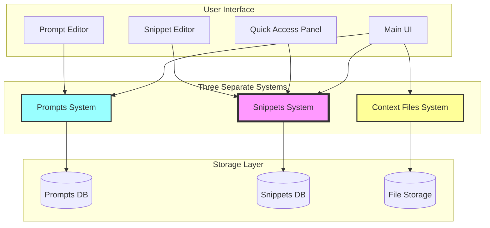

# 📌 Snippets Remain Separate - Implementation Plan

## 📋 Overview

Dit document beschrijft waarom en hoe het Snippets systeem apart blijft van het Prompts systeem, ondanks de eerdere overweging om ze samen te voegen. Na verdere analyse is duidelijk geworden dat Snippets en Prompts verschillende use cases bedienen.

## 🎯 Core Rationale

### De Fundamentele Verschillen

**Snippets**:

- **Quick inserts**: Kleine, herbruikbare text chunks
- **No variables**: Direct copy-paste, geen processing
- **Instant gebruik**: Geen configuratie of parameters
- **Examples**: Git commands, boilerplate code, common responses

**Prompts** (Templates):

- **Variable-driven**: Dynamic content generation met `{variables}`
- **Processing required**: Variables moeten ingevuld worden
- **Configuration needed**: User input voor parameters
- **Examples**: Code generators, email templates, report builders

**Context Files**:

- **External files**: Upload en manage bestanden
- **Rich content**: Images, PDFs, code files
- **Attachment**: Koppelen aan prompts/workflows
- **Examples**: Reference docs, screenshots, data files

## 💡 Why Keep Them Separate?

### 1. **Verschillende Mental Models**

- Users denken anders over snippets vs prompts
- Snippets = "paste bins" / "saved clipboard"
- Prompts = "generators" / "templates"
- Samenvoegen creëert conceptuele verwarring

### 2. **UI/UX Optimalisaties**

- Snippets need snelle toegang (cmd+k style)
- Prompts need configuration UI
- Different interaction patterns
- Different search/filter needs

### 3. **Performance Verschillen**

- Snippets: Instant retrieval, no processing
- Prompts: Parse variables, show form, process
- Snippets kunnen in-memory gecached
- Prompts need meer complex handling

### 4. **Use Case Scenarios**

#### Snippet Use Cases

```markdown
Developer is coding:

1. Types `/gitignore` → instant paste van .gitignore template
2. Types `/readme` → instant paste van README structure
3. Types `/license` → instant paste van MIT license
4. Types `/docker` → instant paste van Dockerfile boilerplate

No configuration, no variables, just instant text.
```

#### Prompt Use Cases

```markdown
Developer needs custom code:

1. Selecteert "React Component Generator"
2. Vult in: name="UserProfile", props=["user", "onEdit"]
3. Kiest options: TypeScript=yes, Tests=yes
4. Genereert complete component met tests

Configuration needed, variables processed, output customized.
```

## 🏗️ Architecture Design

### System Separation



### Data Models Stay Separate

#### Snippet Model (Unchanged)

```javascript
const snippet = {
  id: 'snippet_123',
  name: 'Git Ignore Node',
  description: 'Standard .gitignore for Node projects',
  content: `node_modules/
dist/
.env
*.log`,
  tags: ['git', 'node', 'ignore'],
  folderId: 'dev-tools',
  favorite: false,
  hotkey: 'cmd+shift+g', // Quick access
  usage_count: 45,
  last_used: '2024-01-29T10:00:00Z',
  created_at: '2024-01-01T10:00:00Z',
};
```

#### Prompt Model (Stays as Template)

```javascript
const prompt = {
  id: 'prompt_456',
  name: 'React Component Generator',
  description: 'Generate React component with props and tests',
  content: `import React from 'react';

interface {name}Props {
  {props}
}

export const {name}: React.FC<{name}Props> = ({ {propNames} }) => {
  return (
    <div>
      {/* Component implementation */}
    </div>
  );
};`,
  variables: ['name', 'props', 'propNames'],
  variable_config: {
    name: { type: 'string', validation: 'PascalCase' },
    props: { type: 'multiline', parser: 'typescript' },
    propNames: { type: 'computed', from: 'props' },
  },
  folderId: 'react-tools',
  tags: ['react', 'component', 'generator'],
  created_at: '2024-01-01T10:00:00Z',
};
```

## 🎨 UI/UX Design

### Quick Access for Snippets

```
┌─────────────────────────────────────┐
│ 🔍 Quick Snippet Search (Cmd+K)     │
├─────────────────────────────────────┤
│ Recent:                             │
│ 📌 Git Ignore Node                  │
│ 📌 Docker Compose Template          │
│ 📌 README Structure                 │
├─────────────────────────────────────┤
│ All Snippets:                       │
│ 📁 Dev Tools                        │
│   └─ Git Commands (12)             │
│   └─ Docker Files (8)              │
│ 📁 Code Snippets                    │
│   └─ JavaScript (24)               │
│   └─ Python (18)                   │
└─────────────────────────────────────┘

Click = Insert at cursor
Cmd+Click = Copy to clipboard
```

### Separate Management Interfaces

```
Main Dashboard:
┌──────────────┬──────────────┬──────────────┐
│   Prompts    │   Workflows  │   Snippets   │
│   (Templates)│              │              │
├──────────────┴──────────────┴──────────────┤
│                                             │
│  [Separate sections with different UI]      │
│                                             │
└─────────────────────────────────────────────┘
```

## 🔧 Implementation Strategy

### Phase 1: Clear Separation (Week 1)

- [ ] Rename internal "templates" to "prompts" in code
- [ ] Keep snippets system unchanged
- [ ] Update UI to show 3 distinct sections
- [ ] Add clear icons/colors for differentiation

### Phase 2: Optimize Snippet Access (Week 2)

- [ ] Implement Cmd+K quick access
- [ ] Add snippet hotkeys support
- [ ] Create snippet preview on hover
- [ ] Add usage analytics

### Phase 3: Enhanced Features (Week 3)

- [ ] Snippet categories/folders
- [ ] Import from clipboard history
- [ ] Export snippet collections
- [ ] Team snippet sharing

### Phase 4: Integration Points (Week 4)

- [ ] Snippets in workflows (as steps)
- [ ] Convert snippet → prompt (add variables)
- [ ] Global search across all systems
- [ ] Context files attachment to snippets

## 🔌 API Design

### Separate Endpoints

```javascript
// Prompts (formerly templates)
GET    /api/prompts
POST   /api/prompts
PUT    /api/prompts/:id
DELETE /api/prompts/:id

// Snippets (unchanged)
GET    /api/snippets
POST   /api/snippets
PUT    /api/snippets/:id
DELETE /api/snippets/:id
GET    /api/snippets/quick-access // For Cmd+K

// Context Files (new)
GET    /api/context-files
POST   /api/context-files/upload
DELETE /api/context-files/:id
```

### Quick Access API

```javascript
// GET /api/snippets/quick-access
{
  recent: [
    { id: "snip_1", name: "Git Ignore", hotkey: "cmd+shift+g" },
    { id: "snip_2", name: "Docker Compose", hotkey: null }
  ],
  frequent: [
    { id: "snip_3", name: "Console Log", usage: 145 },
    { id: "snip_4", name: "Try Catch", usage: 89 }
  ],
  categories: [
    {
      name: "Git",
      snippets: [...]
    }
  ]
}
```

## 📊 Benefits of Separation

### For Users

1. **Clear mental model**: No confusion about what each system does
2. **Optimized UX**: Each system has UI tailored to its use case
3. **Faster access**: Snippets remain instantly accessible
4. **No breaking changes**: Existing workflows continue working

### For Developers

1. **Simpler codebase**: No complex unified model
2. **Independent evolution**: Each system can improve separately
3. **Better performance**: Optimized for each use case
4. **Easier testing**: Clear boundaries between systems

### For Business

1. **Lower risk**: No complex migration needed
2. **Faster delivery**: Can improve each system incrementally
3. **Clear value prop**: Easy to explain to new users
4. **Future flexibility**: Can still integrate later if needed

## 🚨 Risks & Mitigations

### Risk: User Confusion

**Mitigation**:

- Clear visual differentiation (icons, colors)
- Onboarding tour explaining differences
- Contextual help tooltips
- Search that indicates source type

### Risk: Feature Duplication

**Mitigation**:

- Regular code review for shared patterns
- Extract common utilities
- Clear ownership boundaries
- Shared component library

### Risk: Maintenance Overhead

**Mitigation**:

- Automated testing for each system
- Clear documentation
- Consistent coding patterns
- Regular refactoring sprints

## 🔄 Migration Considerations

### No Migration Needed!

- Snippets stay as snippets
- Templates become "prompts" (naming only)
- No data structure changes
- No user action required

### Communication Plan

1. Blog post: "Why we're keeping snippets separate"
2. In-app messaging about the rename
3. Updated documentation
4. Video walkthrough of all 3 systems

## 📈 Success Metrics

### Adoption Metrics

- Snippet usage per user per day
- Prompt creation rate
- Quick access (Cmd+K) usage
- Search queries across systems

### Performance Metrics

- Snippet retrieval time <50ms
- Prompt processing time <200ms
- Search response time <100ms
- UI responsiveness scores

### User Satisfaction

- System clarity (survey)
- Feature request patterns
- Support ticket categories
- User retention rates

## 🔗 Related Documentation

- [Original Unification Proposal](../snippets-system-restructuring/README.md)
- [Prompts System Design](../snippets-system-restructuring/prompts-unification.md)
- [Context Files System](../snippets-system-restructuring/context-files-system.md)

---

**Decision**: Keep Snippets, Prompts, and Context Files as three separate but complementary systems.
**Status**: 🟢 Approved  
**Date**: 2024-01-29  
**Next Steps**: Begin Phase 1 implementation
