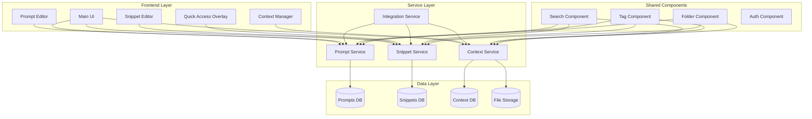

# 🛠️ Implementation Strategy: Three Separate Systems

## 📋 Overview

Gedetailleerde implementatie strategie voor het onderhouden van drie aparte systemen: Prompts (voorheen Templates), Snippets, en Context Files. Focus op clean separation met strategic integration points.

## 🎯 Implementation Principles

### Core Principles

1. **Clear Boundaries**: Elk systeem heeft eigen verantwoordelijkheden
2. **Shared Infrastructure**: Hergebruik common components
3. **Strategic Integration**: Verbind alleen waar het waarde toevoegt
4. **Independent Evolution**: Elk systeem kan apart verbeteren
5. **User Clarity**: Duidelijk verschil in UI/UX

### Technical Guidelines

- **DRY waar mogelijk**: Extract shared utilities
- **Loose Coupling**: Minimize dependencies tussen systemen
- **Interface-based**: Communicate via clear contracts
- **Performance First**: Optimize voor elk systeem's use case
- **Migration Ready**: Design voor toekomstige changes

## 🏗️ System Architecture

### High-Level Architecture



### Service Separation

```javascript
// Prompt Service (formerly Template Service)
class PromptService {
  async create(promptData) {
    // Variable extraction
    const variables = extractVariables(promptData.content);

    // Validation for prompts
    if (variables.length === 0) {
      console.warn('Prompt has no variables - consider using snippet instead');
    }

    return await promptRepository.create({
      ...promptData,
      variables,
      type: 'prompt',
    });
  }
}

// Snippet Service (unchanged)
class SnippetService {
  async create(snippetData) {
    // No variable processing needed
    // Optimized for speed
    return await snippetRepository.create({
      ...snippetData,
      type: 'snippet',
    });
  }

  async getQuickAccess(userId) {
    // Optimized query for cmd+k
    const recent = await this.getRecent(userId, 5);
    const frequent = await this.getFrequent(userId, 10);
    const favorites = await this.getFavorites(userId);

    return {
      recent,
      frequent,
      favorites,
      loadTime: '<50ms', // Performance target
    };
  }
}

// Context File Service (new)
class ContextFileService {
  async upload(file, metadata) {
    // Security scanning
    await securityService.scanFile(file);

    // Storage handling
    const storagePath = await storageService.store(file);

    // Metadata extraction
    const extractedData = await this.extractMetadata(file);

    return await contextRepository.create({
      ...metadata,
      ...extractedData,
      storagePath,
      type: 'context_file',
    });
  }
}
```

## 🎨 UI/UX Implementation

### Main Dashboard Layout

```typescript
const Dashboard = () => {
  const [activeTab, setActiveTab] = useState<'prompts' | 'workflows' | 'snippets'>('prompts');

  return (
    <div className="dashboard">
      <TabBar>
        <Tab
          active={activeTab === 'prompts'}
          icon={<TemplateIcon />}
          label="Prompts"
          onClick={() => setActiveTab('prompts')}
        />
        <Tab
          active={activeTab === 'workflows'}
          icon={<WorkflowIcon />}
          label="Workflows"
          onClick={() => setActiveTab('workflows')}
        />
        <Tab
          active={activeTab === 'snippets'}
          icon={<SnippetIcon />}
          label="Snippets"
          badge={snippetCount}
          onClick={() => setActiveTab('snippets')}
        />
      </TabBar>

      <TabContent>
        {activeTab === 'prompts' && <PromptManager />}
        {activeTab === 'workflows' && <WorkflowManager />}
        {activeTab === 'snippets' && <SnippetManager />}
      </TabContent>

      {/* Global Quick Access */}
      <QuickAccessOverlay />
    </div>
  );
};
```

### Quick Access Implementation

```typescript
const QuickAccessOverlay = () => {
  const [isOpen, setIsOpen] = useState(false);
  const [search, setSearch] = useState('');
  const { snippets, loading } = useQuickSnippets(search);

  // Global keyboard shortcut
  useKeyboardShortcut('cmd+k', () => setIsOpen(true));

  const handleSelect = (snippet: Snippet) => {
    // Insert at current cursor position
    insertAtCursor(snippet.content);
    setIsOpen(false);
  };

  if (!isOpen) return null;

  return (
    <Overlay onClose={() => setIsOpen(false)}>
      <QuickAccessPanel>
        <SearchInput
          value={search}
          onChange={setSearch}
          placeholder="Type snippet name or /command..."
          autoFocus
        />

        <SnippetList>
          {snippets.map(snippet => (
            <SnippetItem
              key={snippet.id}
              snippet={snippet}
              onClick={() => handleSelect(snippet)}
              hotkey={snippet.hotkey}
            />
          ))}
        </SnippetList>

        <FooterHints>
          <Hint>↵ Insert</Hint>
          <Hint>⌘↵ Copy</Hint>
          <Hint>⌥↵ Edit</Hint>
        </FooterHints>
      </QuickAccessPanel>
    </Overlay>
  );
};
```

### Snippet-Specific Features

```typescript
// Snippet Editor with live preview
const SnippetEditor = ({ snippet }: { snippet?: Snippet }) => {
  const [content, setContent] = useState(snippet?.content || '');
  const [preview, setPreview] = useState(true);

  return (
    <EditorLayout>
      <EditorHeader>
        <Input
          label="Snippet Name"
          placeholder="e.g., Git Ignore Node"
        />
        <Input
          label="Trigger"
          placeholder="e.g., /gitignore"
          prefix="/"
        />
        <HotkeyPicker
          label="Hotkey (optional)"
          value={snippet?.hotkey}
        />
      </EditorHeader>

      <EditorBody>
        <CodeEditor
          value={content}
          onChange={setContent}
          language="auto"
          placeholder="Paste or type your snippet content..."
        />

        {preview && (
          <PreviewPane>
            <PreviewHeader>Preview (as inserted)</PreviewHeader>
            <pre>{content}</pre>
          </PreviewPane>
        )}
      </EditorBody>

      <EditorFooter>
        <TagInput />
        <FolderSelect />
        <SaveButton />
      </EditorFooter>
    </EditorLayout>
  );
};
```

## 🔧 Database Implementation

### Separate Tables, Shared Patterns

```sql
-- Prompts table (renamed from templates)
CREATE TABLE prompts (
  id UUID PRIMARY KEY DEFAULT gen_random_uuid(),
  name VARCHAR(255) NOT NULL,
  description TEXT,
  content TEXT NOT NULL,
  variables JSONB DEFAULT '[]',

  -- Shared columns pattern
  folder_id UUID REFERENCES folders(id),
  tags JSONB DEFAULT '[]',
  favorite BOOLEAN DEFAULT false,
  created_by UUID REFERENCES users(id),
  created_at TIMESTAMP DEFAULT NOW(),
  updated_at TIMESTAMP DEFAULT NOW(),

  -- Prompt-specific
  variable_config JSONB DEFAULT '{}',
  category VARCHAR(50),

  -- Search optimization
  search_vector TSVECTOR GENERATED ALWAYS AS (
    setweight(to_tsvector('english', name), 'A') ||
    setweight(to_tsvector('english', COALESCE(description, '')), 'B') ||
    setweight(to_tsvector('english', content), 'C')
  ) STORED
);

-- Snippets table (optimized for retrieval)
CREATE TABLE snippets (
  id UUID PRIMARY KEY DEFAULT gen_random_uuid(),
  name VARCHAR(255) NOT NULL,
  content TEXT NOT NULL,
  trigger VARCHAR(50), -- e.g., '/gitignore'
  hotkey VARCHAR(50), -- e.g., 'cmd+shift+g'

  -- Shared columns pattern
  folder_id UUID REFERENCES folders(id),
  tags JSONB DEFAULT '[]',
  favorite BOOLEAN DEFAULT false,
  created_by UUID REFERENCES users(id),
  created_at TIMESTAMP DEFAULT NOW(),
  updated_at TIMESTAMP DEFAULT NOW(),

  -- Snippet-specific
  usage_count INTEGER DEFAULT 0,
  last_used TIMESTAMP,

  -- Performance indexes
  INDEX idx_snippets_trigger ON snippets(trigger),
  INDEX idx_snippets_usage ON snippets(usage_count DESC),
  INDEX idx_snippets_last_used ON snippets(last_used DESC)
);

-- Context files table (new)
CREATE TABLE context_files (
  id UUID PRIMARY KEY DEFAULT gen_random_uuid(),
  name VARCHAR(255) NOT NULL,
  original_name VARCHAR(255) NOT NULL,
  mime_type VARCHAR(100) NOT NULL,
  file_size BIGINT NOT NULL,
  storage_path TEXT NOT NULL,

  -- Shared columns pattern
  folder_id UUID REFERENCES folders(id),
  tags JSONB DEFAULT '[]',
  created_by UUID REFERENCES users(id),
  created_at TIMESTAMP DEFAULT NOW(),

  -- Context-specific
  file_hash VARCHAR(64), -- SHA256
  extracted_text TEXT, -- For search
  metadata JSONB DEFAULT '{}',

  -- Search vector includes extracted text
  search_vector TSVECTOR GENERATED ALWAYS AS (
    setweight(to_tsvector('english', name), 'A') ||
    setweight(to_tsvector('english', COALESCE(extracted_text, '')), 'C')
  ) STORED
);

-- Shared folders structure
CREATE TABLE folders (
  id UUID PRIMARY KEY DEFAULT gen_random_uuid(),
  name VARCHAR(255) NOT NULL,
  parent_id UUID REFERENCES folders(id),
  icon VARCHAR(50),
  color VARCHAR(7), -- hex color

  -- Folder can contain mixed types
  allowed_types JSONB DEFAULT '["prompt", "snippet", "workflow", "context"]',

  created_by UUID REFERENCES users(id),
  created_at TIMESTAMP DEFAULT NOW()
);
```

### Performance Optimizations

#### Snippet Caching

```javascript
class SnippetCache {
  constructor() {
    this.cache = new Map();
    this.quickAccessCache = new Map();
    this.ttl = 5 * 60 * 1000; // 5 minutes
  }

  async getQuickAccess(userId) {
    const cacheKey = `quick_${userId}`;

    if (this.quickAccessCache.has(cacheKey)) {
      const cached = this.quickAccessCache.get(cacheKey);
      if (Date.now() - cached.timestamp < this.ttl) {
        return cached.data;
      }
    }

    const data = await this.fetchQuickAccess(userId);
    this.quickAccessCache.set(cacheKey, {
      data,
      timestamp: Date.now(),
    });

    return data;
  }

  async preloadFrequent(userId) {
    const frequent = await db.query(
      `
      SELECT * FROM snippets 
      WHERE created_by = $1 
      ORDER BY usage_count DESC 
      LIMIT 20
    `,
      [userId]
    );

    frequent.forEach((snippet) => {
      this.cache.set(snippet.id, snippet);
    });
  }
}
```

#### Search Optimization

```javascript
class UnifiedSearch {
  async search(query, options = {}) {
    const { types = ['prompt', 'snippet', 'workflow'], limit = 20 } = options;

    // Parallel search across systems
    const searches = [];

    if (types.includes('prompt')) {
      searches.push(this.searchPrompts(query));
    }

    if (types.includes('snippet')) {
      searches.push(this.searchSnippets(query));
    }

    if (types.includes('workflow')) {
      searches.push(this.searchWorkflows(query));
    }

    const results = await Promise.all(searches);

    // Merge and rank results
    return this.rankResults(results.flat(), query, limit);
  }

  rankResults(results, query, limit) {
    // Score based on:
    // - Exact match in name: 10 points
    // - Match in trigger: 8 points
    // - Match in content: 5 points
    // - Recent usage: +2 points
    // - Favorite status: +3 points

    return results
      .map((item) => ({
        ...item,
        score: this.calculateScore(item, query),
      }))
      .sort((a, b) => b.score - a.score)
      .slice(0, limit);
  }
}
```

## 🔄 Integration Points

### Strategic Integrations Only

```javascript
// 1. Snippets in Workflows
class WorkflowStep {
  async execute(context) {
    if (this.type === 'snippet') {
      const snippet = await snippetService.get(this.snippetId);
      return {
        output: snippet.content,
        type: 'snippet',
        noVariableProcessing: true,
      };
    }
    // ... other step types
  }
}

// 2. Convert Between Types
class TypeConverter {
  async snippetToPrompt(snippetId) {
    const snippet = await snippetService.get(snippetId);

    // Add variable markers where sensible
    const promptContent = this.identifyVariableOpportunities(snippet.content);

    return await promptService.create({
      name: `${snippet.name} (Converted)`,
      content: promptContent,
      description: `Converted from snippet: ${snippet.description}`,
      tags: [...snippet.tags, 'converted-from-snippet'],
    });
  }

  async promptToSnippet(promptId, variableValues) {
    const prompt = await promptService.get(promptId);

    // Fill in variables with provided values
    const snippetContent = this.fillVariables(prompt.content, variableValues);

    return await snippetService.create({
      name: `${prompt.name} (Static)`,
      content: snippetContent,
      tags: [...prompt.tags, 'converted-from-prompt'],
    });
  }
}

// 3. Context Files Attachment
class ContextAttachment {
  async attachToPrompt(fileId, promptId) {
    await db.query(
      `
      INSERT INTO context_attachments (file_id, entity_type, entity_id)
      VALUES ($1, 'prompt', $2)
    `,
      [fileId, promptId]
    );
  }

  async getAttachments(entityType, entityId) {
    return await db.query(
      `
      SELECT f.* FROM context_files f
      JOIN context_attachments a ON f.id = a.file_id
      WHERE a.entity_type = $1 AND a.entity_id = $2
    `,
      [entityType, entityId]
    );
  }
}
```

## 📊 Monitoring & Analytics

### System-Specific Metrics

```javascript
const metrics = {
  snippets: {
    averageRetrievalTime: histogram('snippet_retrieval_ms'),
    usagePerDay: counter('snippet_usage_daily'),
    mostUsed: gauge('snippet_most_used_id'),
    conversionRate: counter('snippet_to_prompt_conversions'),
  },

  prompts: {
    averageGenerationTime: histogram('prompt_generation_ms'),
    variableComplexity: histogram('prompt_variable_count'),
    usagePerDay: counter('prompt_usage_daily'),
    errorRate: counter('prompt_generation_errors'),
  },

  contextFiles: {
    uploadSize: histogram('context_file_size_bytes'),
    uploadTime: histogram('context_upload_ms'),
    storageUsed: gauge('context_storage_bytes'),
    attachmentCount: counter('context_attachments'),
  },
};
```

## 🚀 Rollout Strategy

### Phase 1: Foundation (Week 1)

- [ ] Rename templates → prompts in codebase
- [ ] Update database schema
- [ ] Create migration scripts
- [ ] Update API endpoints

### Phase 2: UI Separation (Week 2)

- [ ] Implement new dashboard layout
- [ ] Create snippet-specific UI
- [ ] Add quick access overlay
- [ ] Update icons and colors

### Phase 3: Optimization (Week 3)

- [ ] Implement snippet caching
- [ ] Optimize search queries
- [ ] Add performance monitoring
- [ ] Load testing

### Phase 4: Polish (Week 4)

- [ ] User onboarding flow
- [ ] Documentation update
- [ ] Migration tools
- [ ] Launch preparation

## 🎯 Success Criteria

### Performance Targets

- Snippet retrieval: <50ms
- Quick access open: <100ms
- Search response: <200ms
- UI transitions: <16ms (60fps)

### User Satisfaction

- Clear understanding of systems: >90%
- Snippet usage increase: >30%
- Support tickets decrease: >20%
- User retention: >95%

---

**Implementation Priority**: Quick access for snippets is #1 priority for immediate user value.
