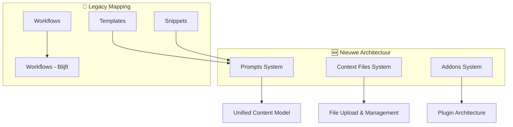

# 🔄 Snippets System Restructuring

## 📋 Overview

Een fundamentele herstructurering van het AirPrompts systeem waarbij we van 3 aparte entiteiten (Templates, Snippets, Workflows) overstappen naar een meer logische 3-systemen architectuur:

1. **Prompts** (Templates + Snippets geünificeerd)
2. **Context Files** (nieuwe functionaliteit)
3. **Addons** (nieuwe extensie functionaliteit)

## 🎯 Problem Statement

### Huidige Situatie

- **Templates**: Herbruikbare tekst met `{variabelen}`
- **Snippets**: Herbruikbare tekst zonder variabelen (met `{{tags}}`)
- **Workflows**: Ketening van templates/snippets

### Geïdentificeerde Problemen

- Templates en Snippets zijn beide **herbruikbare tekst content**
- Duplicatie van functionaliteit (folders, favorites, tags)
- Verwarrende UI (waarom 2 aparte secties?)
- Code complexiteit (overal `templates + snippets` handling)
- Nieuwe use cases passen niet in huidige structuur

### Nieuwe Requirements

1. **Context files uploaden** - Files als context voor prompts
2. **Prompts bewaren** - Eenvoudige tekst zonder variabelen
3. **Addons maken** - Uitbreidingen voor workflows/templates/snippets

## 💡 Solution Architecture

### Core Insight

> **Templates en Snippets zijn beide gewoon "prompts"** - tekst content die herbruikbaar is. Het enige verschil is of ze `{variabelen}` bevatten of niet.

### New System Design

## 📚 Documentation Structure

### Architecture & Design

- **[Architecture Analysis](./architecture-analysis.md)** - Diepgaande analyse en rationale
- **[Prompts Unification](./prompts-unification.md)** - Templates + Snippets → Prompts
- **[Context Files System](./context-files-system.md)** - File upload en management
- **[Addons Plugin System](./addons-plugin-system.md)** - Extensie architectuur

### Implementation Details

- **[Implementation Phases](./implementation-phases.md)** - Gefaseerde uitrol strategie
- **[Database Migration](./database-migration.md)** - Schema wijzigingen en data migratie
- **[API Refactoring](./api-refactoring.md)** - Backend endpoint restructuring
- **[Frontend Component Refactor](./frontend-component-refactor.md)** - UI component changes
- **[Rollback Strategy](./rollback-strategy.md)** - Veiligheidsplan

## 🚀 Implementation Phases

### Fase 1: Prompts Unification (Prioriteit: Hoog)

- Database schema unificatie
- Templates + Snippets → Prompts migratie
- UI component refactoring
- Backward compatibility

### Fase 2: Context Files System (Prioriteit: Medium)

- File upload infrastructuur
- Storage en security systeem
- Context koppeling aan prompts
- Preview functionaliteit

### Fase 3: Addons System (Prioriteit: Medium)

- Plugin architectuur design
- Addon attachment systeem
- Marketplace-style UI
- Developer API

## ⚡ Key Benefits

### Voor Gebruikers

- **Eenvoudiger conceptueel model**: Één "Prompts" systeem i.p.v. Templates + Snippets
- **Flexibelere content creation**: `{variabelen}` optioneel, niet verplicht
- **File context support**: Upload bestanden voor rijkere prompts
- **Extensibiliteit**: Addons voor custom functionaliteit

### Voor Ontwikkelaars

- **Code simplificatie**: Elimineer template/snippet duplicatie
- **Unified patterns**: Consistent component gedrag
- **Betere schaalbaarheid**: Plugin-architectuur voor extensies
- **Minder maintenance**: Unified data model

## 📊 Success Metrics

- [ ] **Code Reduction**: 30% minder LOC door eliminatie duplicatie
- [ ] **User Onboarding**: 50% sneller begrip van systeem
- [ ] **Feature Adoption**: Verhoogd gebruik van context files en addons
- [ ] **Developer Experience**: Snellere feature development

## 🔗 Related Documentation

- [Existing Database Structure](../../../DATABASE_STRUCTURE.md)
- [Current API Documentation](../../../docs/claude-generated/AGENT_BRIEFINGS/backend-brief.md)
- [Frontend Architecture](../../../docs/claude-generated/AGENT_BRIEFINGS/frontend-brief.md)

---

**Status**: 🟡 Planning Phase  
**Priority**: High  
**Target**: Q1 2025  
**Last Updated**: 2025-01-29
