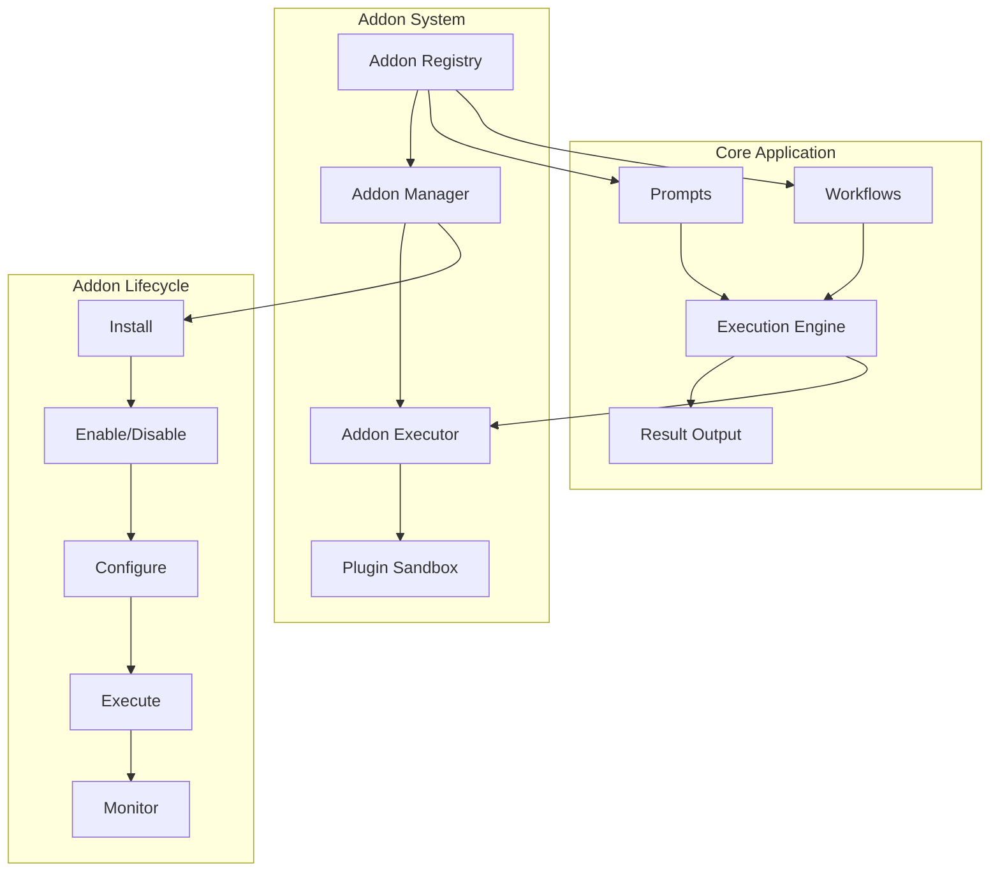

# 🔌 Addons Plugin System

## 📋 Overview

Een extensie systeem dat gebruikers toestaat om custom addons te maken die gekoppeld kunnen worden aan prompts, workflows en snippets. Dit systeem biedt een plugin architectuur voor uitbreidbaarheid zonder de core applicatie te wijzigen.

## 🎯 Use Cases & Requirements

### Primary Use Cases

1. **Custom Actions**: Custom processing stappen voor workflows
2. **Content Enhancement**: Automatische content transformaties
3. **External Integrations**: Koppeling met third-party services
4. **UI Extensions**: Custom input components voor prompts
5. **Data Processing**: Custom data manipulation en formatting
6. **Validation Rules**: Custom validation logic voor inputs

### Example Addons

```javascript
// Example: Code formatter addon
const codeFormatterAddon = {
  name: 'Code Formatter',
  description: 'Automatically format code based on language',
  trigger: 'before_execution', // when to run
  supportedLanguages: ['javascript', 'python', 'css'],

  execute: async (content, options) => {
    const { language } = options;
    return await formatCode(content, language);
  },
};

// Example: Translation addon
const translationAddon = {
  name: 'Auto Translator',
  description: 'Translate prompt content to different languages',
  trigger: 'after_execution',

  execute: async (content, options) => {
    const { targetLanguage } = options;
    return await translate(content, targetLanguage);
  },
};

// Example: API integration addon
const slackNotifierAddon = {
  name: 'Slack Notifier',
  description: 'Send workflow results to Slack channel',
  trigger: 'workflow_complete',

  execute: async (result, options) => {
    const { webhook, channel } = options;
    return await sendToSlack(webhook, channel, result);
  },
};
```

## 🏗️ System Architecture

### High-Level Design



### Data Model

```javascript
// Addon Entity
const addon = {
  id: 'addon_code_formatter_v1',
  name: 'Code Formatter',
  description: 'Automatically format and beautify code',
  version: '1.2.0',
  author: 'john@example.com',

  // Addon metadata
  category: 'formatting', // "formatting", "integration", "validation", "processing"
  tags: ['code', 'formatting', 'javascript', 'python'],

  // Runtime configuration
  triggers: ['before_execution', 'on_save'], // When addon runs
  supportedEntityTypes: ['prompt', 'workflow'], // What it can attach to

  // Code & configuration
  code: `
    async function execute(content, context, options) {
      const { language } = options;
      return await formatCode(content, language);
    }
  `,
  configSchema: {
    type: 'object',
    properties: {
      language: { type: 'string', enum: ['javascript', 'python', 'css'] },
      indentSize: { type: 'number', default: 2 },
    },
  },

  // Security & permissions
  permissions: ['read_content', 'modify_content'], // Required permissions
  sandboxed: true, // Run in secure sandbox
  allowedAPIs: ['formatting', 'string_utils'], // Allowed API access

  // Lifecycle
  enabled: true,
  installedAt: '2025-01-29T10:00:00Z',
  lastUsed: '2025-01-29T11:30:00Z',
  usageCount: 45,

  // Error handling
  errorCount: 0,
  lastError: null,
  maxErrors: 10, // Disable after too many errors

  // Marketplace metadata (optional)
  marketplaceId: 'com.airprompts.addons.code-formatter',
  downloadCount: 1250,
  rating: 4.8,
  updateAvailable: false,
};

// Addon Attachment (linking addons to entities)
const addonAttachment = {
  id: 'attachment_123',
  addonId: 'addon_code_formatter_v1',
  entityType: 'prompt', // "prompt", "workflow", "snippet"
  entityId: 'prompt_456',

  // Execution configuration for this specific attachment
  configuration: {
    language: 'javascript',
    indentSize: 4,
    enabled: true,
  },

  // Execution order (multiple addons on same entity)
  executionOrder: 1,

  // Trigger specification
  triggers: ['before_execution'],

  // Audit trail
  attachedBy: 'user_123',
  attachedAt: '2025-01-29T12:00:00Z',
  lastExecuted: '2025-01-29T13:00:00Z',
  executionCount: 12,
};
```

### Plugin Execution Sandbox

```javascript
// Secure execution environment
class AddonSandbox {
  constructor(addon) {
    this.addon = addon;
    this.context = this.createSandboxContext();
    this.timeoutMs = 30000; // 30 second timeout
    this.memoryLimit = 128 * 1024 * 1024; // 128MB memory limit
  }

  createSandboxContext() {
    // Create isolated execution context
    const sandbox = {
      // Safe built-in functions
      console: {
        log: (...args) => this.logOutput('log', args),
        warn: (...args) => this.logOutput('warn', args),
        error: (...args) => this.logOutput('error', args),
      },

      // Utility libraries (whitelist only)
      _: require('lodash'), // Safe utility functions
      moment: require('moment'), // Date manipulation

      // Custom API access based on permissions
      api: this.createAPIAccess(),

      // Prevent access to dangerous globals
      process: undefined,
      require: undefined,
      global: undefined,
      __dirname: undefined,
      __filename: undefined,
    };

    return sandbox;
  }

  createAPIAccess() {
    const allowedAPIs = this.addon.allowedAPIs || [];
    const api = {};

    // Formatting API
    if (allowedAPIs.includes('formatting')) {
      api.formatting = {
        formatCode: async (code, language) => {
          return await this.safeAPICall('formatting.formatCode', code, language);
        },
        prettifyJSON: (json) => JSON.stringify(JSON.parse(json), null, 2),
      };
    }

    // HTTP API (with restrictions)
    if (allowedAPIs.includes('http')) {
      api.http = {
        get: async (url) => {
          if (!this.isAllowedURL(url)) {
            throw new Error('URL not allowed');
          }
          return await this.safeAPICall('http.get', url);
        },
      };
    }

    return api;
  }

  async execute(content, context, options) {
    return new Promise((resolve, reject) => {
      const timeout = setTimeout(() => {
        reject(new Error('Addon execution timeout'));
      }, this.timeoutMs);

      try {
        // Create isolated VM
        const vm = require('vm');

        // Inject addon code into sandbox
        const addonScript = new vm.Script(`
          (async function() {
            ${this.addon.code}
            
            // Call the main execute function
            return await execute(content, context, options);
          })();
        `);

        // Execute in sandbox with memory limit
        const result = addonScript.runInNewContext(this.context, {
          timeout: this.timeoutMs,
          breakOnSigint: true,
        });

        clearTimeout(timeout);
        resolve(result);
      } catch (error) {
        clearTimeout(timeout);
        reject(error);
      }
    });
  }

  logOutput(level, args) {
    // Log addon output for debugging
    console.log(`[Addon:${this.addon.name}:${level}]`, ...args);
  }

  safeAPICall(apiMethod, ...args) {
    // Implement rate limiting and monitoring for API calls
    return this.apiRegistry.call(apiMethod, ...args);
  }

  isAllowedURL(url) {
    // Implement URL whitelist/blacklist
    const allowedDomains = ['api.github.com', 'jsonplaceholder.typicode.com'];
    const urlObj = new URL(url);
    return allowedDomains.includes(urlObj.hostname);
  }
}
```

## 🔌 Addon Registry & Management

### Addon Manager Service

```javascript
class AddonManager {
  constructor() {
    this.registry = new Map(); // Loaded addons
    this.attachments = new Map(); // Entity attachments
    this.executionQueue = []; // Queued executions
  }

  // Install addon
  async installAddon(addonData, userId) {
    // Validate addon structure
    const validation = this.validateAddon(addonData);
    if (!validation.valid) {
      throw new Error(`Invalid addon: ${validation.errors.join(', ')}`);
    }

    // Security scan
    const securityScan = await this.scanAddonCode(addonData.code);
    if (securityScan.dangerous) {
      throw new Error('Addon contains potentially dangerous code');
    }

    // Save to database
    const addon = await db.addons.create({
      ...addonData,
      installedBy: userId,
      installedAt: new Date(),
      enabled: false, // Start disabled for security
    });

    // Load into registry
    this.registry.set(addon.id, addon);

    return addon;
  }

  // Enable/disable addon
  async toggleAddon(addonId, enabled, userId) {
    const addon = await db.addons.findByIdAndUser(addonId, userId);
    if (!addon) {
      throw new Error('Addon not found');
    }

    // Update in database and registry
    await db.addons.update(addonId, { enabled });

    if (this.registry.has(addonId)) {
      this.registry.get(addonId).enabled = enabled;
    }

    // Log state change
    await db.addonLogs.create({
      addonId,
      action: enabled ? 'enabled' : 'disabled',
      userId,
      timestamp: new Date(),
    });
  }

  // Attach addon to entity
  async attachAddon(addonId, entityType, entityId, configuration, userId) {
    const addon = this.registry.get(addonId);
    if (!addon || !addon.enabled) {
      throw new Error('Addon not available');
    }

    // Validate entity type is supported
    if (!addon.supportedEntityTypes.includes(entityType)) {
      throw new Error(`Addon does not support ${entityType} entities`);
    }

    // Validate configuration against schema
    const configValidation = this.validateConfiguration(configuration, addon.configSchema);
    if (!configValidation.valid) {
      throw new Error(`Invalid configuration: ${configValidation.errors.join(', ')}`);
    }

    // Create attachment
    const attachment = await db.addonAttachments.create({
      addonId,
      entityType,
      entityId,
      configuration,
      attachedBy: userId,
      attachedAt: new Date(),
    });

    // Update local cache
    const cacheKey = `${entityType}:${entityId}`;
    if (!this.attachments.has(cacheKey)) {
      this.attachments.set(cacheKey, []);
    }
    this.attachments.get(cacheKey).push(attachment);

    return attachment;
  }

  // Execute addons for an entity
  async executeAddons(entityType, entityId, trigger, content, context) {
    const cacheKey = `${entityType}:${entityId}`;
    const attachments = this.attachments.get(cacheKey) || [];

    // Filter by trigger and execution order
    const relevantAttachments = attachments
      .filter((att) => att.triggers.includes(trigger))
      .sort((a, b) => (a.executionOrder || 0) - (b.executionOrder || 0));

    let processedContent = content;
    const results = [];

    for (const attachment of relevantAttachments) {
      try {
        const addon = this.registry.get(attachment.addonId);
        if (!addon || !addon.enabled) continue;

        // Create sandbox and execute
        const sandbox = new AddonSandbox(addon);
        const result = await sandbox.execute(processedContent, context, attachment.configuration);

        // Update content for next addon (pipeline processing)
        if (result && typeof result === 'string') {
          processedContent = result;
        }

        results.push({
          addonId: addon.id,
          attachmentId: attachment.id,
          result,
          executedAt: new Date(),
        });

        // Update usage statistics
        await this.updateUsageStats(addon.id, attachment.id);
      } catch (error) {
        // Log error but continue with other addons
        console.error(`Addon execution error: ${attachment.addonId}`, error);

        await this.logAddonError(attachment.addonId, error);
        results.push({
          addonId: attachment.addonId,
          attachmentId: attachment.id,
          error: error.message,
          executedAt: new Date(),
        });
      }
    }

    return {
      processedContent,
      results,
    };
  }

  validateAddon(addonData) {
    const errors = [];

    // Required fields
    if (!addonData.name) errors.push('Name is required');
    if (!addonData.code) errors.push('Code is required');
    if (!addonData.triggers?.length) errors.push('At least one trigger is required');

    // Code validation
    try {
      new Function(addonData.code); // Basic syntax check
    } catch (e) {
      errors.push('Invalid JavaScript code');
    }

    return {
      valid: errors.length === 0,
      errors,
    };
  }

  async scanAddonCode(code) {
    // Basic security scan for dangerous patterns
    const dangerousPatterns = [
      /eval\s*\(/,
      /Function\s*\(/,
      /require\s*\(/,
      /process\./,
      /fs\./,
      /child_process/,
      /vm\./,
      /__dirname/,
      /__filename/,
    ];

    const dangerous = dangerousPatterns.some((pattern) => pattern.test(code));

    return { dangerous };
  }
}
```

## 🎨 UI Components

### Addon Marketplace

```jsx
const AddonMarketplace = () => {
  const [addons, setAddons] = useState([]);
  const [categories, setCategories] = useState(['all']);
  const [selectedCategory, setSelectedCategory] = useState('all');

  return (
    <div className="addon-marketplace">
      <div className="marketplace-header">
        <h2>Addon Marketplace</h2>
        <div className="marketplace-controls">
          <CategoryFilter
            categories={categories}
            selected={selectedCategory}
            onChange={setSelectedCategory}
          />
          <SearchInput placeholder="Search addons..." />
        </div>
      </div>

      <div className="addon-grid">
        {filteredAddons.map((addon) => (
          <AddonCard
            key={addon.id}
            addon={addon}
            onInstall={handleInstallAddon}
            onUninstall={handleUninstallAddon}
            isInstalled={installedAddons.includes(addon.id)}
          />
        ))}
      </div>
    </div>
  );
};

const AddonCard = ({ addon, onInstall, isInstalled }) => {
  return (
    <Card className="addon-card">
      <div className="addon-header">
        <h3>{addon.name}</h3>
        <div className="addon-meta">
          <Badge variant={addon.category}>{addon.category}</Badge>
          <span className="version">v{addon.version}</span>
        </div>
      </div>

      <p className="addon-description">{addon.description}</p>

      <div className="addon-stats">
        <span>⭐ {addon.rating}</span>
        <span>⬇️ {addon.downloadCount}</span>
        <span>👤 {addon.author}</span>
      </div>

      <div className="addon-tags">
        {addon.tags.map((tag) => (
          <Tag key={tag}>{tag}</Tag>
        ))}
      </div>

      <div className="addon-actions">
        {isInstalled ? (
          <Button variant="outline" disabled>
            ✅ Installed
          </Button>
        ) : (
          <Button onClick={() => onInstall(addon)}>Install</Button>
        )}
        <Button variant="ghost" onClick={() => showAddonDetails(addon)}>
          Details
        </Button>
      </div>
    </Card>
  );
};
```

### Addon Manager Interface

```jsx
const AddonManager = () => {
  const [installedAddons, setInstalledAddons] = useState([]);
  const [selectedAddon, setSelectedAddon] = useState(null);

  return (
    <div className="addon-manager">
      <div className="addon-list">
        <h3>Installed Addons</h3>
        {installedAddons.map((addon) => (
          <AddonListItem
            key={addon.id}
            addon={addon}
            selected={selectedAddon?.id === addon.id}
            onClick={() => setSelectedAddon(addon)}
            onToggle={(enabled) => handleToggleAddon(addon.id, enabled)}
          />
        ))}
      </div>

      {selectedAddon && (
        <div className="addon-details">
          <AddonDetails
            addon={selectedAddon}
            onConfigure={handleConfigureAddon}
            onUninstall={handleUninstallAddon}
          />
        </div>
      )}
    </div>
  );
};

const AddonListItem = ({ addon, selected, onClick, onToggle }) => {
  return (
    <div className={`addon-list-item ${selected ? 'selected' : ''}`} onClick={onClick}>
      <div className="addon-info">
        <h4>{addon.name}</h4>
        <p>{addon.description}</p>
        <div className="addon-status">
          <StatusBadge status={addon.enabled ? 'enabled' : 'disabled'} />
          <span className="usage-count">Used {addon.usageCount} times</span>
        </div>
      </div>

      <div className="addon-controls">
        <Toggle checked={addon.enabled} onChange={onToggle} label="Enabled" />
      </div>
    </div>
  );
};
```

### Addon Attachment Interface

```jsx
const AddonAttacher = ({ entityType, entityId, onAttach }) => {
  const [availableAddons, setAvailableAddons] = useState([]);
  const [selectedAddon, setSelectedAddon] = useState(null);
  const [configuration, setConfiguration] = useState({});

  const compatibleAddons = availableAddons.filter(
    (addon) => addon.supportedEntityTypes.includes(entityType) && addon.enabled
  );

  return (
    <Modal title="Attach Addon">
      <div className="addon-attacher">
        {/* Addon Selection */}
        <div className="addon-selection">
          <h4>Select Addon</h4>
          <Select
            options={compatibleAddons}
            value={selectedAddon}
            onChange={setSelectedAddon}
            renderOption={(addon) => (
              <div className="addon-option">
                <span>{addon.name}</span>
                <small>{addon.description}</small>
              </div>
            )}
          />
        </div>

        {/* Configuration */}
        {selectedAddon && (
          <div className="addon-configuration">
            <h4>Configuration</h4>
            <DynamicForm
              schema={selectedAddon.configSchema}
              values={configuration}
              onChange={setConfiguration}
            />
          </div>
        )}

        {/* Trigger Selection */}
        {selectedAddon && (
          <div className="trigger-selection">
            <h4>Triggers</h4>
            <CheckboxGroup
              options={selectedAddon.triggers}
              value={selectedTriggers}
              onChange={setSelectedTriggers}
            />
          </div>
        )}

        <div className="attachment-actions">
          <Button
            onClick={() => onAttach(selectedAddon.id, configuration)}
            disabled={!selectedAddon}
          >
            Attach Addon
          </Button>
        </div>
      </div>
    </Modal>
  );
};
```

## 🔌 API Endpoints

### Addon Management

```javascript
// Install addon
// POST /api/addons/install
app.post('/api/addons/install', async (req, res) => {
  try {
    const addonData = req.body;
    const addon = await addonManager.installAddon(addonData, req.user.id);
    res.json(addon);
  } catch (error) {
    res.status(400).json({ error: error.message });
  }
});

// List user's addons
// GET /api/addons
app.get('/api/addons', async (req, res) => {
  const { category, enabled } = req.query;

  const filters = { installedBy: req.user.id };
  if (category && category !== 'all') filters.category = category;
  if (enabled !== undefined) filters.enabled = enabled === 'true';

  const addons = await db.addons.findMany(filters);
  res.json(addons);
});

// Toggle addon
// PUT /api/addons/:addonId/toggle
app.put('/api/addons/:addonId/toggle', async (req, res) => {
  const { enabled } = req.body;
  await addonManager.toggleAddon(req.params.addonId, enabled, req.user.id);
  res.json({ success: true });
});

// Attach addon to entity
// POST /api/addons/:addonId/attach
app.post('/api/addons/:addonId/attach', async (req, res) => {
  const { entityType, entityId, configuration, triggers } = req.body;

  const attachment = await addonManager.attachAddon(
    req.params.addonId,
    entityType,
    entityId,
    { ...configuration, triggers },
    req.user.id
  );

  res.json(attachment);
});

// Get entity attachments
// GET /api/entities/:entityType/:entityId/addons
app.get('/api/entities/:entityType/:entityId/addons', async (req, res) => {
  const { entityType, entityId } = req.params;

  const attachments = await db.addonAttachments.findMany({
    entityType,
    entityId,
    attachedBy: req.user.id,
  });

  // Include addon details
  const attachmentsWithAddons = await Promise.all(
    attachments.map(async (attachment) => ({
      ...attachment,
      addon: await db.addons.findById(attachment.addonId),
    }))
  );

  res.json(attachmentsWithAddons);
});
```

### Marketplace API

```javascript
// Browse marketplace
// GET /api/marketplace/addons
app.get('/api/marketplace/addons', async (req, res) => {
  const { category, search, sort = 'popular' } = req.query;

  // This would typically fetch from a marketplace service
  const addons = await marketplaceService.searchAddons({
    category,
    search,
    sort,
  });

  res.json(addons);
});

// Get addon details
// GET /api/marketplace/addons/:marketplaceId
app.get('/api/marketplace/addons/:marketplaceId', async (req, res) => {
  const addon = await marketplaceService.getAddonDetails(req.params.marketplaceId);
  res.json(addon);
});
```

## 🧪 Testing Strategy

### Addon Execution Tests

```javascript
describe('Addon Execution', () => {
  test('addon executes successfully in sandbox', async () => {
    const testAddon = {
      id: 'test-addon',
      name: 'Test Addon',
      code: `
        async function execute(content, context, options) {
          return content.toUpperCase();
        }
      `,
      triggers: ['before_execution'],
      supportedEntityTypes: ['prompt'],
    };

    const sandbox = new AddonSandbox(testAddon);
    const result = await sandbox.execute('hello world', {}, {});

    expect(result).toBe('HELLO WORLD');
  });

  test('addon timeout protection works', async () => {
    const infiniteLoopAddon = {
      code: `
        async function execute(content) {
          while(true) {} // Infinite loop
          return content;
        }
      `,
    };

    const sandbox = new AddonSandbox(infiniteLoopAddon);
    sandbox.timeoutMs = 1000; // 1 second timeout

    await expect(sandbox.execute('test', {}, {})).rejects.toThrow('timeout');
  });

  test('dangerous code is blocked', async () => {
    const dangerousAddon = {
      code: `
        async function execute(content) {
          const fs = require('fs'); // Should be blocked
          return fs.readFileSync('/etc/passwd');
        }
      `,
    };

    await expect(addonManager.installAddon(dangerousAddon, 'user123')).rejects.toThrow(
      'dangerous code'
    );
  });
});
```

### Integration Tests

```javascript
describe('Addon Integration', () => {
  test('addons execute in correct order', async () => {
    const prompt = await createTestPrompt('Test prompt');

    // Attach multiple addons with different execution orders
    await attachAddon(prompt.id, 'uppercase-addon', { executionOrder: 1 });
    await attachAddon(prompt.id, 'exclamation-addon', { executionOrder: 2 });

    const result = await executePromptWithAddons(prompt.id, 'hello');

    expect(result.processedContent).toBe('HELLO!');
  });

  test('addon failure does not break execution', async () => {
    const prompt = await createTestPrompt('Test prompt');

    await attachAddon(prompt.id, 'failing-addon', {});
    await attachAddon(prompt.id, 'working-addon', {});

    const result = await executePromptWithAddons(prompt.id, 'test');

    expect(result.processedContent).toBeDefined(); // Should still work
    expect(result.results.some((r) => r.error)).toBe(true); // Should log error
  });
});
```

## 📊 Performance & Monitoring

### Performance Optimization

```javascript
class AddonPerformanceMonitor {
  constructor() {
    this.executionTimes = new Map();
    this.memoryUsage = new Map();
    this.errorCounts = new Map();
  }

  async measureExecution(addonId, executionFn) {
    const startTime = process.hrtime.bigint();
    const startMemory = process.memoryUsage();

    try {
      const result = await executionFn();

      const endTime = process.hrtime.bigint();
      const endMemory = process.memoryUsage();

      // Track performance metrics
      this.recordMetrics(addonId, {
        executionTime: Number(endTime - startTime) / 1000000, // Convert to ms
        memoryDelta: endMemory.heapUsed - startMemory.heapUsed,
        success: true,
      });

      return result;
    } catch (error) {
      this.recordError(addonId, error);
      throw error;
    }
  }

  recordMetrics(addonId, metrics) {
    if (!this.executionTimes.has(addonId)) {
      this.executionTimes.set(addonId, []);
    }

    this.executionTimes.get(addonId).push(metrics);

    // Keep only last 100 executions
    if (this.executionTimes.get(addonId).length > 100) {
      this.executionTimes.get(addonId).shift();
    }
  }

  getPerformanceReport(addonId) {
    const executions = this.executionTimes.get(addonId) || [];

    if (executions.length === 0) {
      return { noData: true };
    }

    const times = executions.map((e) => e.executionTime);
    const memories = executions.map((e) => e.memoryDelta);

    return {
      averageExecutionTime: times.reduce((a, b) => a + b) / times.length,
      maxExecutionTime: Math.max(...times),
      minExecutionTime: Math.min(...times),
      averageMemoryUsage: memories.reduce((a, b) => a + b) / memories.length,
      executionCount: executions.length,
      errorRate: this.getErrorRate(addonId),
    };
  }
}
```

## 🚀 Migration & Rollout Strategy

### Phase 1: Core Infrastructure (Week 1-2)

- [ ] Addon entity model and database schema
- [ ] Basic addon manager service
- [ ] Sandbox execution environment
- [ ] Security validation system

### Phase 2: Basic UI (Week 3-4)

- [ ] Addon installation interface
- [ ] Enable/disable addon management
- [ ] Basic configuration forms
- [ ] Attachment management UI

### Phase 3: Marketplace Integration (Week 5-6)

- [ ] Marketplace browsing interface
- [ ] Addon search and filtering
- [ ] Installation from marketplace
- [ ] Rating and review system

### Phase 4: Advanced Features (Week 7-8)

- [ ] Performance monitoring dashboard
- [ ] Advanced security scanning
- [ ] Addon versioning system
- [ ] Developer tools and documentation

---

**Next Steps**:

1. Design addon security model
2. Create sandbox execution prototype
3. Define marketplace integration requirements
4. Plan developer onboarding process
