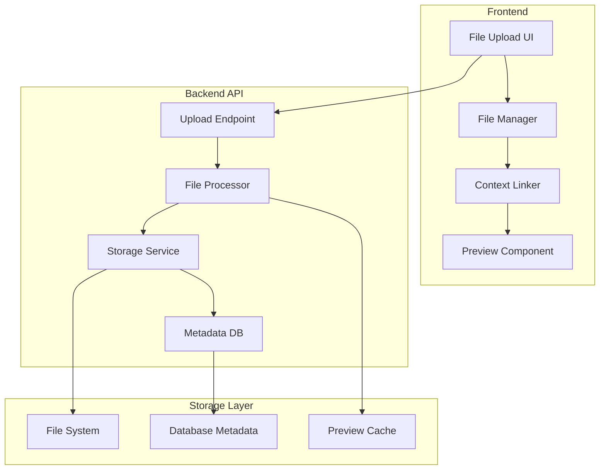

# 📁 Context Files System

## 📋 Overview

Een nieuw systeem voor het uploaden, opslaan en koppelen van bestanden als context voor prompts en workflows. Dit adresseert de use case "context files kunnen uploaden" als een apart, gespecialiseerd systeem.

## 🎯 Use Cases & Requirements

### Primary Use Cases

1. **Code Context**: Upload source files voor code review prompts
2. **Document Analysis**: PDF/Word documents voor analysis prompts
3. **Data Context**: JSON/CSV files voor data processing workflows
4. **Image Context**: Screenshots voor UI/UX feedback prompts
5. **Configuration Files**: Settings/config files voor deployment prompts

### Functional Requirements

- **File Upload**: Drag & drop en file browser support
- **File Preview**: In-app preview voor ondersteunde file types
- **Context Linking**: Koppeling aan specific prompts/workflows
- **File Management**: Organize, rename, delete files
- **Search**: Search binnen file content waar mogelijk
- **Version Control**: File versioning en history

### Non-Functional Requirements

- **Security**: File type validation, malware scanning
- **Performance**: Efficient storage en retrieval
- **Storage Limits**: Configurable per-user storage limits
- **Backup**: File backup en recovery strategy

## 🏗️ System Architecture

### High-Level Design



### Data Model

```javascript
// Context File Entity
const contextFile = {
  id: 'file_abc123',
  name: 'component-analysis.jsx',
  originalName: 'MyComponent.jsx', // User's original filename
  description: 'React component for analysis',

  // File metadata
  mimeType: 'text/javascript',
  fileSize: 15420, // bytes
  fileHash: 'sha256:abc123...', // For deduplication

  // Storage info
  storagePath: '/storage/files/2025/01/file_abc123.jsx',
  previewPath: '/storage/previews/file_abc123_preview.jpg', // Optional

  // Context associations
  linkedPrompts: ['prompt_123', 'prompt_456'],
  linkedWorkflows: ['workflow_789'],

  // File analysis (auto-generated)
  extractedText: "import React from 'react'...", // For searchable content
  fileType: 'source_code', // "document", "image", "data", "config", etc.
  language: 'javascript', // For code files

  // Security
  scanStatus: 'clean', // "pending", "clean", "flagged", "quarantined"
  scanDate: '2025-01-29T10:00:00Z',

  // Metadata
  tags: ['react', 'component', 'frontend'],
  folderId: 'project_alpha',

  // Audit trail
  uploadedBy: 'user_123',
  uploadedAt: '2025-01-29T09:30:00Z',
  lastAccessed: '2025-01-29T11:00:00Z',
  accessCount: 5,

  // Versioning
  version: 1,
  parentFileId: null, // For file versions
  isLatestVersion: true,
};
```

### File Type Support Matrix

```javascript
const supportedFileTypes = {
  // Text-based files (full content extraction)
  text: {
    mimeTypes: ['text/plain', 'text/markdown', 'text/csv'],
    maxSize: '10MB',
    preview: 'text',
    searchable: true,
  },

  // Source code (syntax highlighting + content extraction)
  source_code: {
    mimeTypes: ['text/javascript', 'text/python', 'text/html', 'application/json'],
    maxSize: '5MB',
    preview: 'code',
    searchable: true,
    languages: ['javascript', 'python', 'html', 'css', 'json', 'yaml', 'xml'],
  },

  // Documents (text extraction via OCR/parsing)
  document: {
    mimeTypes: [
      'application/pdf',
      'application/msword',
      'application/vnd.openxmlformats-officedocument.wordprocessingml.document',
    ],
    maxSize: '50MB',
    preview: 'document',
    searchable: true, // Via text extraction
    processors: ['pdf-parse', 'mammoth'],
  },

  // Images (metadata + OCR for text extraction)
  image: {
    mimeTypes: ['image/jpeg', 'image/png', 'image/gif', 'image/webp'],
    maxSize: '20MB',
    preview: 'image',
    searchable: true, // Via OCR
    processors: ['sharp', 'tesseract'], // resize + OCR
  },

  // Data files (schema analysis + preview)
  data: {
    mimeTypes: ['application/json', 'text/csv', 'application/xml'],
    maxSize: '100MB',
    preview: 'data_table',
    searchable: true,
    processors: ['csv-parser', 'xml-parser'],
  },

  // Archives (extract + analyze contents)
  archive: {
    mimeTypes: ['application/zip', 'application/x-tar', 'application/gzip'],
    maxSize: '500MB',
    preview: 'archive_contents',
    searchable: true, // Contents
    processors: ['zip-extract', 'tar-extract'],
  },
};
```

## 🔒 Security Considerations

### File Upload Security

```javascript
const securityMiddleware = {
  // File type validation
  validateFileType: (file) => {
    const allowedTypes = Object.values(supportedFileTypes).flatMap((type) => type.mimeTypes);

    if (!allowedTypes.includes(file.mimetype)) {
      throw new Error(`File type ${file.mimetype} not allowed`);
    }
  },

  // File size limits
  validateFileSize: (file, maxSize) => {
    if (file.size > maxSize) {
      throw new Error(`File size exceeds limit of ${maxSize}`);
    }
  },

  // Malware scanning
  scanFile: async (filePath) => {
    // Integrate with ClamAV or similar
    const scanResult = await clamav.scanFile(filePath);

    if (scanResult.isInfected) {
      await quarantineFile(filePath);
      throw new Error('File failed security scan');
    }

    return { status: 'clean', scanDate: new Date() };
  },

  // Content analysis
  analyzeContent: async (file) => {
    // Check for suspicious patterns
    const content = await fs.readFile(file.path, 'utf8');
    const suspiciousPatterns = [
      /eval\s*\(/g, // JavaScript eval
      /<script>/g, // Embedded scripts
      /system\s*\(/g, // System calls
    ];

    const flagged = suspiciousPatterns.some((pattern) => pattern.test(content));

    return { flagged, patterns: flagged ? suspiciousPatterns : [] };
  },
};
```

### Storage Security

```javascript
const storageConfig = {
  // Isolated storage per user
  userStoragePath: (userId) => `/storage/users/${userId}/files/`,

  // File access permissions
  filePermissions: {
    owner: 'read,write,delete',
    group: 'read', // Team members
    public: 'none',
  },

  // Encryption at rest
  encryption: {
    algorithm: 'AES-256-GCM',
    keyRotation: '90days',
    backupEncryption: true,
  },

  // Access logging
  auditLog: {
    logAccess: true,
    logModifications: true,
    retentionPeriod: '2years',
  },
};
```

## 🎨 UI/UX Design

### File Upload Interface

```jsx
const FileUploadZone = () => {
  return (
    <div className="file-upload-zone">
      {/* Drag & Drop Area */}
      <DropZone
        onDrop={handleFileDrop}
        accept={Object.values(supportedFileTypes).flatMap((t) => t.mimeTypes)}
        maxSize={maxFileSize}
      >
        <div className="upload-prompt">
          <FiUpload className="upload-icon" />
          <p>Drag files here or click to browse</p>
          <small>Supports: Code, Documents, Images, Data files</small>
        </div>
      </DropZone>

      {/* Upload Progress */}
      {uploads.map((upload) => (
        <UploadProgress
          key={upload.id}
          file={upload.file}
          progress={upload.progress}
          status={upload.status}
        />
      ))}
    </div>
  );
};
```

### File Manager Interface

```jsx
const FileManager = ({ files, onSelect, onLink }) => {
  return (
    <div className="file-manager">
      {/* Search & Filters */}
      <div className="file-controls">
        <SearchInput placeholder="Search files and content..." onSearch={handleSearch} />
        <FileTypeFilter
          types={['all', 'code', 'documents', 'images', 'data']}
          selected={activeFilter}
          onChange={setActiveFilter}
        />
      </div>

      {/* File Grid/List */}
      <div className="file-grid">
        {filteredFiles.map((file) => (
          <FileCard
            key={file.id}
            file={file}
            preview={getFilePreview(file)}
            onSelect={() => onSelect(file)}
            onLink={() => onLink(file)}
            showLinkStatus={file.linkedPrompts.length > 0}
          />
        ))}
      </div>
    </div>
  );
};
```

### Context Linking Interface

```jsx
const ContextLinker = ({ file, prompts, workflows, onLink }) => {
  return (
    <Modal title={`Link ${file.name} to Context`}>
      <div className="context-linker">
        {/* Link to Prompts */}
        <section>
          <h3>Link to Prompts</h3>
          <SearchableList
            items={prompts}
            selected={file.linkedPrompts}
            onToggle={(promptId) => onLink('prompt', promptId)}
            renderItem={(prompt) => (
              <PromptListItem prompt={prompt} isLinked={file.linkedPrompts.includes(prompt.id)} />
            )}
          />
        </section>

        {/* Link to Workflows */}
        <section>
          <h3>Link to Workflows</h3>
          <SearchableList
            items={workflows}
            selected={file.linkedWorkflows}
            onToggle={(workflowId) => onLink('workflow', workflowId)}
          />
        </section>

        {/* Suggested Links (AI-powered) */}
        <section>
          <h3>Suggested Links</h3>
          {getSuggestedLinks(file).map((suggestion) => (
            <SuggestionCard
              key={suggestion.id}
              suggestion={suggestion}
              onAccept={() => onLink(suggestion.type, suggestion.id)}
            />
          ))}
        </section>
      </div>
    </Modal>
  );
};
```

## 🔌 API Endpoints

### File Operations

```javascript
// Upload file
// POST /api/context-files/upload
app.post('/api/context-files/upload', upload.single('file'), async (req, res) => {
  try {
    const file = req.file;
    const { description, tags, folderId } = req.body;

    // Security validation
    await securityMiddleware.validateFileType(file);
    await securityMiddleware.validateFileSize(file, getMaxSize(file.mimetype));

    // Scan file
    const scanResult = await securityMiddleware.scanFile(file.path);

    // Process file (extract text, generate preview, etc.)
    const processedFile = await fileProcessor.process(file);

    // Save to storage
    const storagePath = await storageService.save(file, processedFile);

    // Save metadata to database
    const contextFile = await db.contextFiles.create({
      name: generateSafeName(file.originalname),
      originalName: file.originalname,
      description,
      mimeType: file.mimetype,
      fileSize: file.size,
      storagePath,
      extractedText: processedFile.text,
      fileType: classifyFileType(file.mimetype),
      tags: JSON.parse(tags || '[]'),
      folderId,
      scanStatus: scanResult.status,
      scanDate: scanResult.scanDate,
      uploadedBy: req.user.id,
      uploadedAt: new Date(),
    });

    res.json(contextFile);
  } catch (error) {
    // Clean up file on error
    if (req.file?.path) {
      await fs.unlink(req.file.path);
    }
    res.status(400).json({ error: error.message });
  }
});

// List files
// GET /api/context-files
app.get('/api/context-files', async (req, res) => {
  const {
    search,
    fileType,
    folderId,
    linkedTo, // 'prompt:123' or 'workflow:456'
    tags,
    page = 1,
    limit = 20,
  } = req.query;

  const filters = {
    uploadedBy: req.user.id, // Security: only user's files
  };

  if (search) {
    filters.search = search; // Search in name, description, extractedText
  }

  if (fileType && fileType !== 'all') {
    filters.fileType = fileType;
  }

  if (folderId) {
    filters.folderId = folderId;
  }

  if (linkedTo) {
    const [type, id] = linkedTo.split(':');
    filters.linkedTo = { type, id };
  }

  if (tags) {
    filters.tags = JSON.parse(tags);
  }

  const { files, total } = await db.contextFiles.findMany({
    filters,
    pagination: { page: parseInt(page), limit: parseInt(limit) },
    orderBy: { uploadedAt: 'desc' },
  });

  res.json({ files, total, page, limit });
});

// Link file to prompt/workflow
// POST /api/context-files/:fileId/link
app.post('/api/context-files/:fileId/link', async (req, res) => {
  const { fileId } = req.params;
  const { entityType, entityId } = req.body; // 'prompt' or 'workflow'

  // Verify file ownership
  const file = await db.contextFiles.findByIdAndUser(fileId, req.user.id);
  if (!file) {
    return res.status(404).json({ error: 'File not found' });
  }

  // Verify entity exists
  const entity = await db[`${entityType}s`].findById(entityId);
  if (!entity) {
    return res.status(404).json({ error: `${entityType} not found` });
  }

  // Create link
  await db.contextFileLinks.create({
    fileId,
    entityType,
    entityId,
    createdBy: req.user.id,
    createdAt: new Date(),
  });

  // Update file's linked arrays
  const linkedField = `linked${entityType.charAt(0).toUpperCase() + entityType.slice(1)}s`;
  await db.contextFiles.update(fileId, {
    [linkedField]: [...(file[linkedField] || []), entityId],
  });

  res.json({ success: true });
});
```

### File Preview & Content

```javascript
// Get file preview
// GET /api/context-files/:fileId/preview
app.get('/api/context-files/:fileId/preview', async (req, res) => {
  const file = await db.contextFiles.findByIdAndUser(req.params.fileId, req.user.id);

  if (!file) {
    return res.status(404).json({ error: 'File not found' });
  }

  const previewData = await generatePreview(file);
  res.json(previewData);
});

// Download file
// GET /api/context-files/:fileId/download
app.get('/api/context-files/:fileId/download', async (req, res) => {
  const file = await db.contextFiles.findByIdAndUser(req.params.fileId, req.user.id);

  if (!file) {
    return res.status(404).json({ error: 'File not found' });
  }

  // Log access
  await db.contextFiles.update(file.id, {
    lastAccessed: new Date(),
    accessCount: file.accessCount + 1,
  });

  res.download(file.storagePath, file.originalName);
});
```

## 🔗 Integration with Prompts & Workflows

### Context Injection in Prompts

```javascript
// Enhanced prompt execution with context files
const executePromptWithContext = async (prompt, variables, contextFileIds = []) => {
  // Get linked context files
  const contextFiles = await db.contextFiles.findByIds(contextFileIds);

  // Extract content from files
  const contextContent = await Promise.all(
    contextFiles.map(async (file) => {
      const content = await getFileContent(file);
      return {
        fileName: file.name,
        fileType: file.fileType,
        content: content.slice(0, 10000), // Limit context size
      };
    })
  );

  // Inject context into prompt
  let enhancedPrompt = prompt.content;

  // Replace variables
  Object.entries(variables).forEach(([key, value]) => {
    enhancedPrompt = enhancedPrompt.replace(new RegExp(`{${key}}`, 'g'), value);
  });

  // Add context section
  if (contextContent.length > 0) {
    const contextSection = contextContent
      .map((ctx) => `\n\n--- Context from ${ctx.fileName} (${ctx.fileType}) ---\n${ctx.content}`)
      .join('');

    enhancedPrompt += `\n\n=== CONTEXT FILES ===${contextSection}`;
  }

  return enhancedPrompt;
};
```

### Workflow Context Passing

```javascript
// Pass context through workflow steps
const executeWorkflowStep = async (step, previousOutput, sharedContext) => {
  const { prompt, contextFileIds = [] } = step;

  // Combine step-specific context with shared workflow context
  const allContextFiles = [...contextFileIds, ...sharedContext.contextFileIds];

  const variables = {
    ...step.variables,
    previous_output: previousOutput,
  };

  return await executePromptWithContext(prompt, variables, allContextFiles);
};
```

## 📊 Storage & Performance

### Storage Strategy

```javascript
const storageService = {
  // Hierarchical storage by date and user
  getStoragePath: (userId, fileId, originalName) => {
    const date = new Date();
    const year = date.getFullYear();
    const month = String(date.getMonth() + 1).padStart(2, '0');
    const ext = path.extname(originalName);

    return `storage/users/${userId}/${year}/${month}/${fileId}${ext}`;
  },

  // Deduplication based on file hash
  deduplicateFile: async (fileHash, userId) => {
    const existing = await db.contextFiles.findByHash(fileHash, userId);

    if (existing) {
      // Create reference to existing file instead of storing duplicate
      return {
        isDuplicate: true,
        existingFileId: existing.id,
        storageSpace: existing.fileSize,
      };
    }

    return { isDuplicate: false };
  },

  // Cleanup orphaned files
  cleanupOrphanedFiles: async () => {
    const orphanedFiles = await db.contextFiles.findOrphaned();

    for (const file of orphanedFiles) {
      await fs.unlink(file.storagePath);
      await db.contextFiles.delete(file.id);
    }
  },
};
```

### Caching Strategy

```javascript
const cacheService = {
  // Preview cache
  previewCache: new Map(),

  generateAndCachePreview: async (file) => {
    const cacheKey = `preview:${file.id}:${file.updatedAt}`;

    if (this.previewCache.has(cacheKey)) {
      return this.previewCache.get(cacheKey);
    }

    const preview = await generatePreview(file);
    this.previewCache.set(cacheKey, preview);

    // Auto-expire cache after 1 hour
    setTimeout(
      () => {
        this.previewCache.delete(cacheKey);
      },
      60 * 60 * 1000
    );

    return preview;
  },
};
```

## 🧪 Testing Strategy

### File Upload Tests

```javascript
describe('Context Files Upload', () => {
  test('uploads valid file successfully', async () => {
    const testFile = new FormData();
    testFile.append('file', new Blob(['test content']), 'test.txt');
    testFile.append('description', 'Test file');

    const response = await request(app)
      .post('/api/context-files/upload')
      .attach('file', Buffer.from('test content'), 'test.txt')
      .field('description', 'Test file')
      .expect(200);

    expect(response.body.name).toBe('test.txt');
    expect(response.body.fileSize).toBe(12);
  });

  test('rejects malicious file', async () => {
    const maliciousContent = '<script>alert("xss")</script>';

    await request(app)
      .post('/api/context-files/upload')
      .attach('file', Buffer.from(maliciousContent), 'malicious.html')
      .expect(400)
      .expect((res) => {
        expect(res.body.error).toContain('security scan');
      });
  });
});
```

### Integration Tests

```javascript
describe('Context File Integration', () => {
  test('files linked to prompt are included in execution', async () => {
    // Create context file
    const contextFile = await createTestFile('test-context.txt', 'Context content');

    // Create prompt
    const prompt = await createTestPrompt('Analyze: {input}');

    // Link file to prompt
    await linkFileToPrompt(contextFile.id, prompt.id);

    // Execute prompt with context
    const result = await executePromptWithContext(prompt, { input: 'test' }, [contextFile.id]);

    expect(result).toContain('Context content');
    expect(result).toContain('test-context.txt');
  });
});
```

## 🚀 Migration & Rollout

### Phase 1: Infrastructure

- [ ] File upload endpoints
- [ ] Storage service setup
- [ ] Security scanning integration
- [ ] Basic file management UI

### Phase 2: Context Integration

- [ ] Link files to prompts
- [ ] Context injection in execution
- [ ] Preview generation
- [ ] Search functionality

### Phase 3: Advanced Features

- [ ] Workflow context passing
- [ ] AI-powered link suggestions
- [ ] Advanced file analysis
- [ ] Version control for files

---

**Next Steps**:

1. Define storage infrastructure requirements
2. Set up security scanning tools
3. Create file upload UI prototype
4. Implement basic file operations API
